# WEEK 3 - Laporan Praktikum 1-6

- **Praktikum 1 (Migrasi / skema DB):** Menyiapkan database PWL_POS dan melakukan konfigurasi environment pada project Laravel.

	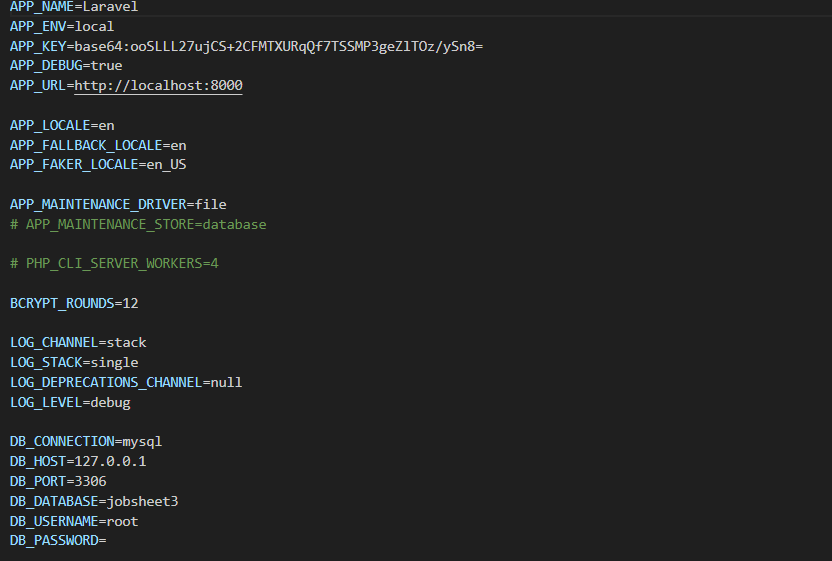

- **Praktikum 2 (Model + Factory):** Membuat file migrasi untuk mengelola skema database secara terstruktur tanpa perlu menulis query SQL secara manual

	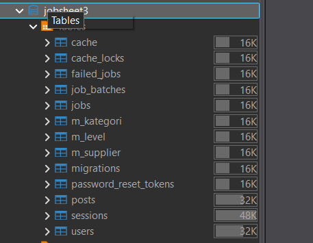
    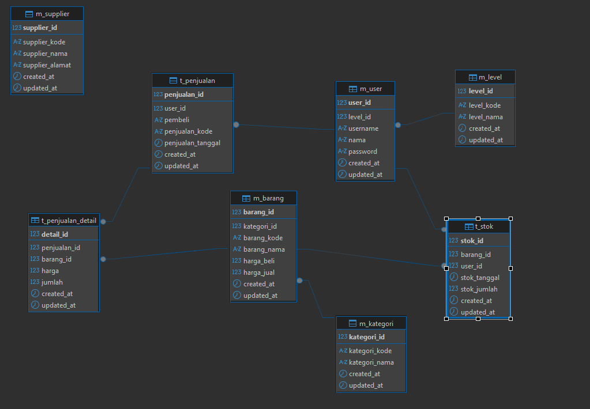

- **Praktikum 3 (Seeder):** Menginput data awal dummmy ke dalam tabel database secara otomatis menggunakan fitur Seeder pada Laravel.

	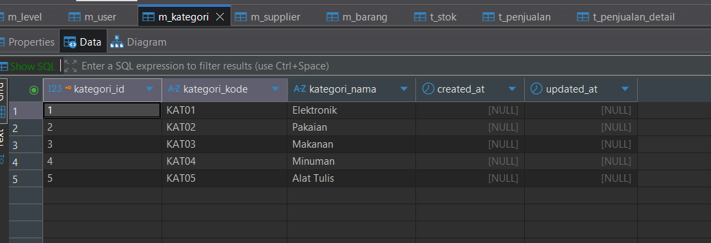
    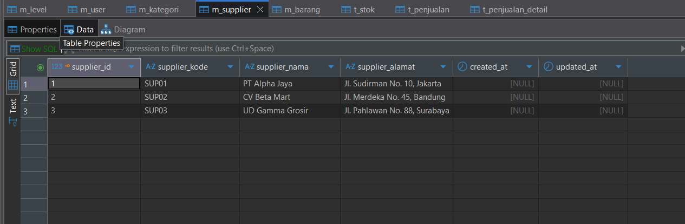
	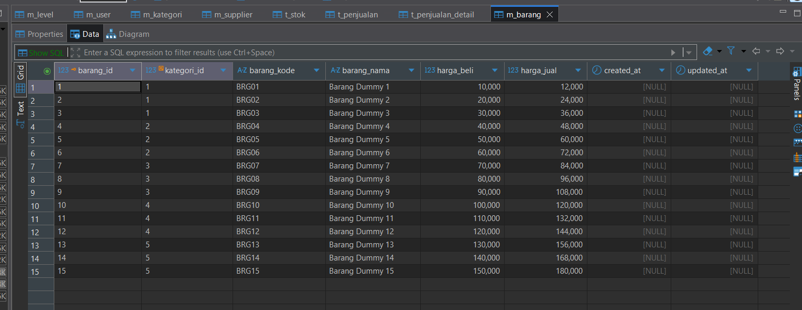

- **Praktikum 4 (Relasi):** Mengambil dan memanipulasi data dari database menggunakan mekanisme DB Facade bawaan Laravel untuk diolah di lapisan Controller maupun ditampilkan lewat lapisan View (blade).

	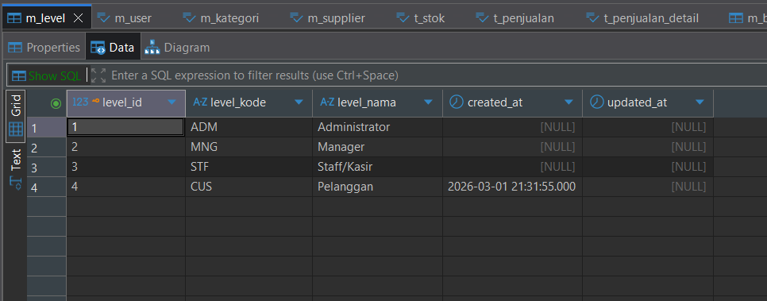
	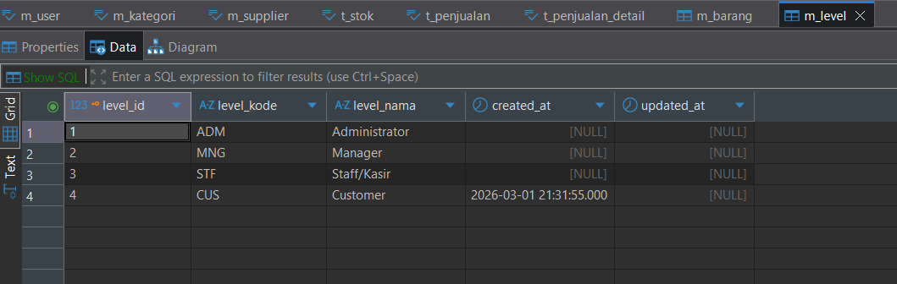
	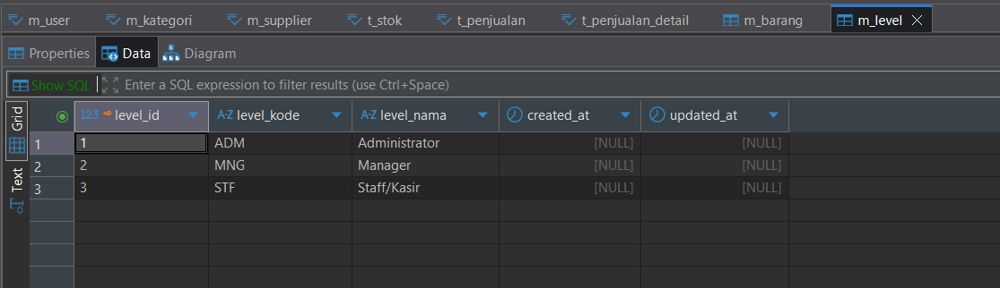
	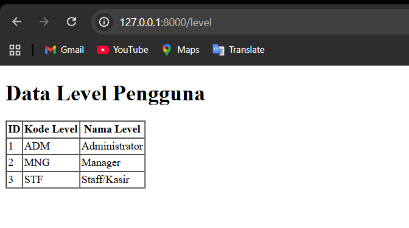

- **Praktikum 5 (Controller & Routes):** Mengambil dan memanipulasi data dari database menggunakan metode DB Query Builder Laravel (contohnya DB::table()).

	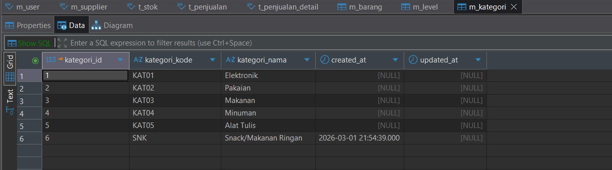
	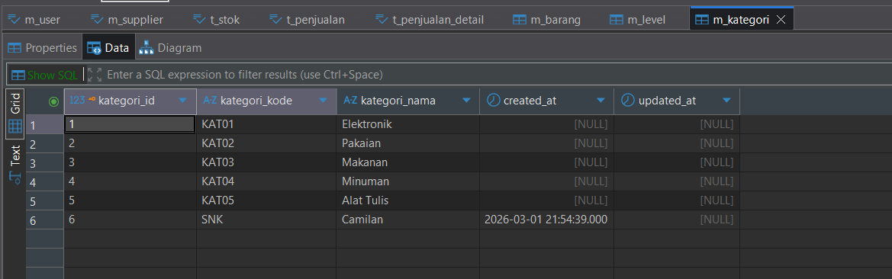
	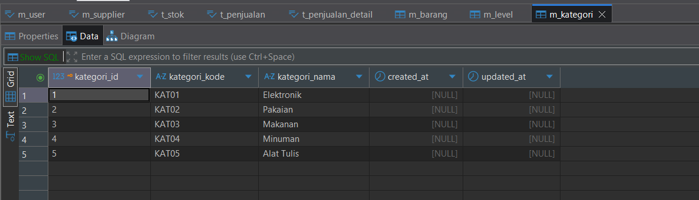
	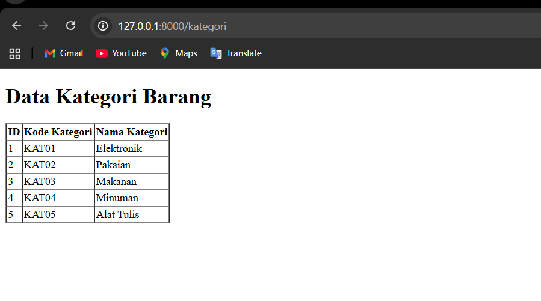

- **Praktikum 6 (Views / CRUD):** Mengambil, menambahkan, dan memanipulasi data di database menggunakan paradigma berorientasi objek (OOP) di Eloquent ORM Laravel.

	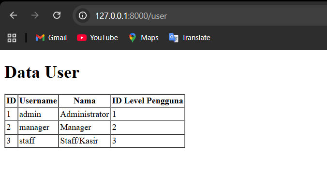
	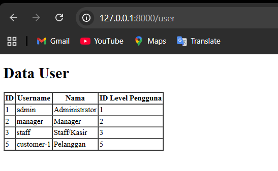
	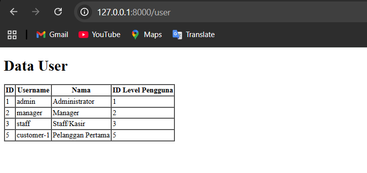

- **Pertanyaan**

**1. Fungsi `APP_KEY` pada file `.env`** `APP_KEY` adalah kunci enkripsi utama (biasanya berupa string acak 32 karakter) yang digunakan oleh Laravel. Fungsinya sangat krusial untuk keamanan aplikasi, yaitu untuk mengenkripsi data seperti *session*, *cookies*, dan *password reset tokens*. Jika `APP_KEY` ini diubah atau hilang, semua *session* pengguna yang sedang aktif akan menjadi tidak valid, dan data yang sebelumnya dienkripsi oleh aplikasi tidak akan bisa didekripsi lagi.

**2. Cara men-generate nilai `APP_KEY`** Nilai ini di-generate melalui antarmuka *Command Line* (CLI) atau terminal menggunakan perintah bawaan Artisan:
`php artisan key:generate`  
Perintah ini akan secara otomatis membuat string acak yang aman secara kriptografi dan menyimpannya ke variabel `APP_KEY` di dalam file `.env`.

**3. File Migrasi Default pada Laravel** Secara default (terutama pada Laravel versi 10 ke atas), instalasi baru akan menyediakan 3 hingga 4 file migrasi dasar:
* `..._create_users_table.php`: Untuk membuat tabel `users` (menyimpan data pengguna/akun).
* `..._create_password_reset_tokens_table.php`: Untuk menyimpan token saat pengguna meminta pemulihan password.
* `..._create_failed_jobs_table.php`: Untuk mencatat *queue* (antrean tugas) di latar belakang yang gagal dieksekusi.
* *(Terkadang)* `..._create_personal_access_tokens_table.php`: Digunakan oleh Laravel Sanctum untuk otentikasi API.

**4. Tujuan/Output dari `$table->timestamps();`** Fungsi ini adalah *shortcut* (pintasan) yang secara otomatis akan membuat dua buah kolom bertipe `TIMESTAMP` (atau `DATETIME` tergantung konfigurasi database) pada tabel tersebut, yaitu:
* `created_at`: Mencatat waktu pasti kapan baris data tersebut pertama kali di-insert ke database.
* `updated_at`: Mencatat waktu pasti kapan baris data tersebut terakhir kali di-update atau diubah.

**5. Tipe Data dari `$table->id();`** Secara spesifik di MySQL/MariaDB, fungsi `$table->id();` akan menghasilkan tipe data `BIGINT UNSIGNED` (bilangan bulat besar positif) yang dilengkapi dengan atribut `AUTO_INCREMENT` serta ditetapkan sebagai `PRIMARY KEY` (Kunci Utama).

**6. Perbedaan `$table->id();` dan `$table->id('level_id');`** * `$table->id();`: Akan membuat kolom *Primary Key* dengan nama default, yaitu `id`.
* `$table->id('level_id');`: Akan membuat kolom *Primary Key* dengan spesifikasi yang sama persis, tetapi namanya diubah secara kustom menjadi `level_id`.

**7. Fungsi `->unique()`** Fungsi `->unique()` digunakan untuk menambahkan konstrain (*constraint*) *Unique* pada tingkat database. Artinya, database akan menolak dan mengeluarkan error jika ada upaya untuk memasukkan data yang sama (duplikat) ke dalam kolom tersebut (contoh penggunaan: kolom `username` atau `email`).

**8. Perbedaan penggunaan pada kolom `level_id` di tabel `m_user` dan `m_level`** Ini berkaitan dengan konsep **Relasi / Foreign Key**:
* Pada tabel `m_level`, `$table->id('level_id')` digunakan karena `level_id` bertindak sebagai **Primary Key** (kunci utama) yang nilainya harus bertambah otomatis (`AUTO_INCREMENT`).
* Pada tabel `m_user`, kolom `level_id` bertindak sebagai **Foreign Key** (kunci tamu) yang merujuk ke tabel `m_level`. Karena ia hanya "merujuk", tipe datanya **harus sama persis** dengan *Primary Key* di tabel asalnya (yaitu `BIGINT UNSIGNED`), tetapi ia **tidak boleh** bersifat *auto-increment*. Oleh karena itu, digunakanlah `$table->unsignedBigInteger('level_id')`.

**9. Tujuan Class `Hash` dan `Hash::make('1234');`** * **Tujuan Class `Hash`**: Menyediakan cara yang aman untuk melakukan *hashing* (enkripsi satu arah) terhadap data sensitif seperti *password*, biasanya menggunakan algoritma Bcrypt atau Argon2.
* **Maksud `Hash::make('1234')`**: Fungsi ini menerima string teks biasa (`"1234"`) dan mengubahnya menjadi *string hash* yang panjang dan acak (misal: `$2y$10$92IXUNpkjO0rOQ5byMi.Ye4oKoEa3Ro9...`). Ini memastikan jika database diretas, *password* asli tidak bisa dibaca begitu saja.

**10. Kegunaan tanda tanya (`?`) pada Query Builder** Tanda tanya (`?`) tersebut dikenal sebagai **Parameter Binding** (Pengikatan Parameter). Fungsinya adalah sebagai *placeholder* (tempat penampung) data. Penggunaan `?` sangat penting untuk keamanan karena mencegah serangan **SQL Injection**; PDO (*PHP Data Objects*) di balik layar akan memisahkan struktur *query* SQL dengan data inputan *user*, sehingga *user* tidak bisa menyisipkan perintah SQL jahat.

**11. Tujuan penulisan `protected $table` dan `protected $primaryKey`** Secara default, sistem Eloquent ORM di Laravel menebak nama tabel dan *primary key* berdasarkan nama *Class Model*.
* `protected $table = 'm_user';`: Memaksa model untuk menggunakan tabel bernama `m_user`, bukan nama default yang ditebak Laravel (seperti `users` atau `m_users`).
* `protected $primaryKey = 'user_id';`: Memberi tahu Eloquent bahwa *Primary Key* tabel tersebut bernama `user_id`, bukan `id` seperti asumsi awal Laravel.

**12. Mana yang lebih mudah untuk operasi CRUD?** Secara umum dalam ekosistem Laravel, menggunakan **Eloquent ORM** adalah yang **paling mudah dan disarankan**.
* *Alasan:* Eloquent merepresentasikan tabel database sebagai sebuah Objek (*Object-Oriented*), sehingga penulisan kodenya sangat rapi, intuitif, dan manusiawi (misal: `User::find(1)` atau `$user->save()`). Eloquent juga sangat memudahkan dalam memanggil relasi antar tabel (seperti `$user->level->nama_level`) tanpa perlu menulis *query* `JOIN` SQL yang panjang dan rumit seperti pada *DB Facade* atau *Query Builder*.