# Laporan Praktikum: Model dan Eloquent ORM
**Mata Kuliah:** Pemrograman Web Lanjut (PWL)
**Pertemuan ke-:** 4 (empat)

---

## Praktikum 1 - $fillable

**1. Hasil Eksekusi Langkah 3:**
Setelah menambahkan data dengan array `$data` pada `UserController` dan mengeksekusi `UserModel::create($data)`, data `manager_dua` dan `manager_tiga` berhasil disimpan ke dalam database dan ditampilkan pada halaman web. Hal ini terjadi karena atribut `level_id`, `username`, `nama`, dan `password` telah didaftarkan ke dalam properti `$fillable` di `UserModel`, yang mengizinkan proses *mass assignment* atau penambahan data secara massal.

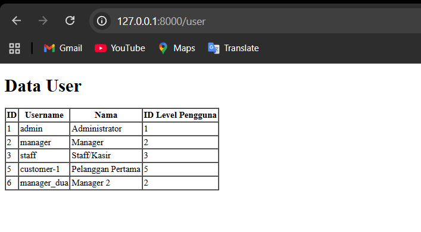

**2. Hasil Eksekusi Langkah 6:**
Setelah menghapus `password` dari array `$fillable` pada `UserModel` menjadi `['level_id', 'username', 'nama']`, akan terjadi *error* atau nilai `password` tidak tersimpan ke dalam database saat dipanggil. Properti `$fillable` bertindak sebagai sistem keamanan, sehingga atribut yang tidak terdaftar akan diabaikan oleh Eloquent.

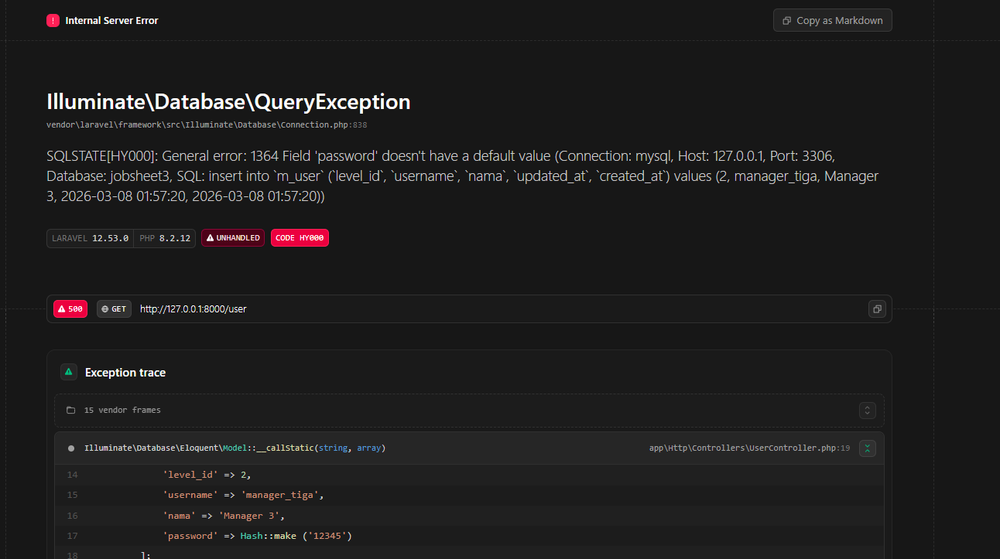

---

## Praktikum 2.1 - Retrieving Single Models

**1. Penjelasan Langkah 3 (Metode `find`):**
Kode `$user = UserModel::find(1);` digunakan untuk mengambil satu rekaman tunggal dari database berdasarkan *primary key*, yaitu ID 1.

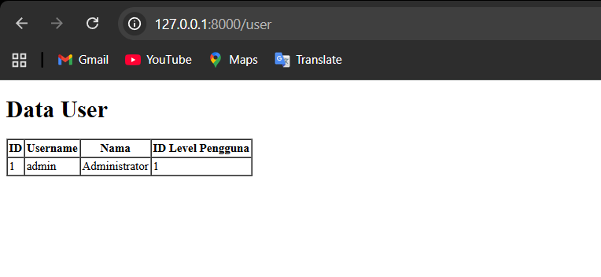

**2. Penjelasan Langkah 5 (Metode `first`):**
Kode `$user = UserModel::where('level_id', 1)->first();` mengambil model pertama yang cocok dengan batasan kueri, yaitu baris pertama dengan `level_id` bernilai 1.

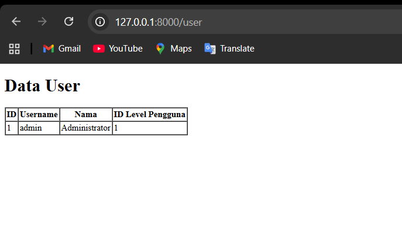

**3. Penjelasan Langkah 7 (Metode `firstWhere`):**
Kode `$user = UserModel::firstWhere('level_id', 1);` adalah penulisan singkat (*shorthand*) dari metode `where` dan `first`, yang menghasilkan *output* yang sama dengan langkah 5.

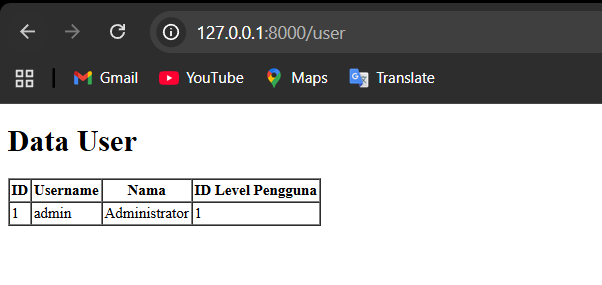

**4. Penjelasan Langkah 9 (Metode `findOr` - ID Ditemukan):**
Mencoba mencari *user* dengan ID 1. Karena datanya ada, fungsi `abort(404)` tidak dieksekusi, dan data *user* dikembalikan ke *view*.

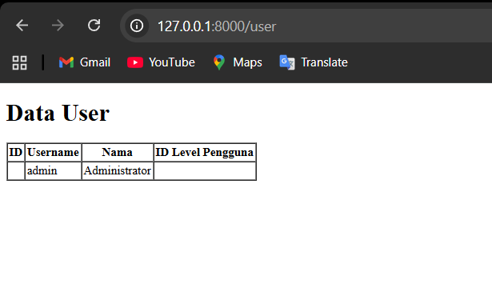

**5. Penjelasan Langkah 11 (Metode `findOr` - ID Tidak Ditemukan):**
Mencoba mencari ID 20. Karena data tidak ada, Eloquent menjalankan fungsi `abort(404)`, sehingga halaman web menampilkan status *404 Not Found*.

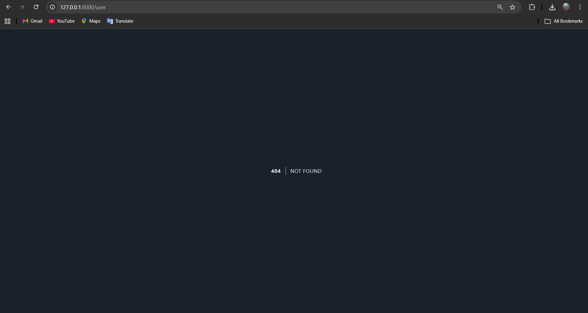

---

## Praktikum 2.2 - Not Found Exceptions

**1. Penjelasan Langkah 2 (`findOrFail`):**
Mengeksekusi pengambilan data dengan ID 1. Karena tersedia, hasil ditampilkan normal tanpa *exception*.

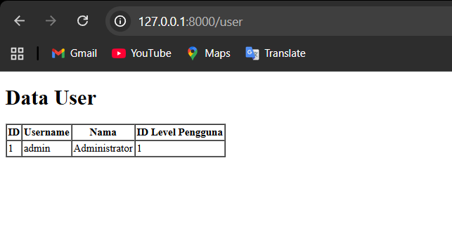

**2. Penjelasan Langkah 4 (`firstOrFail`):**
Mencari baris dengan username 'manager9'. Karena tidak ditemukan, metode ini melempar `ModelNotFoundException` yang memicu halaman 404.

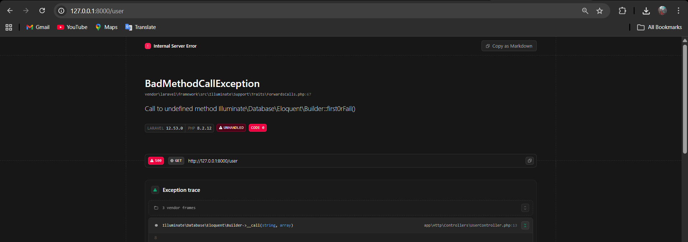

---

## Praktikum 2.3 - Retrieving Aggregates

**1. Penjelasan Langkah 2 & 3 (Metode `count`):**
Metode agregat `count()` digunakan untuk menghitung total baris data yang memiliki `level_id` bernilai 2, menghasilkan angka integer total pengguna.

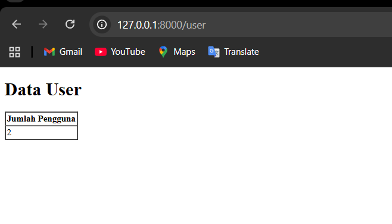

---

## Praktikum 2.4 - Retrieving or Creating Models

**1. Penjelasan Langkah 3 (`firstOrCreate` - Data Sudah Ada):**
Mencari *record* dengan parameter username 'manager'. Karena sudah ada, data langsung diambil tanpa menambahkan data baru.

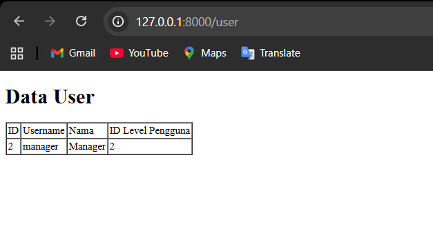

**2. Penjelasan Langkah 5 (`firstOrCreate` - Data Belum Ada):**
Karena parameter 'manager22' tidak ditemukan, metode ini otomatis membuat dan melakukan *insert* data baru ke database.

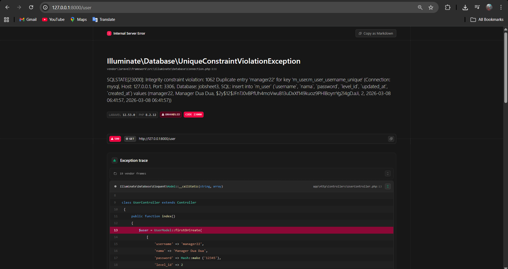
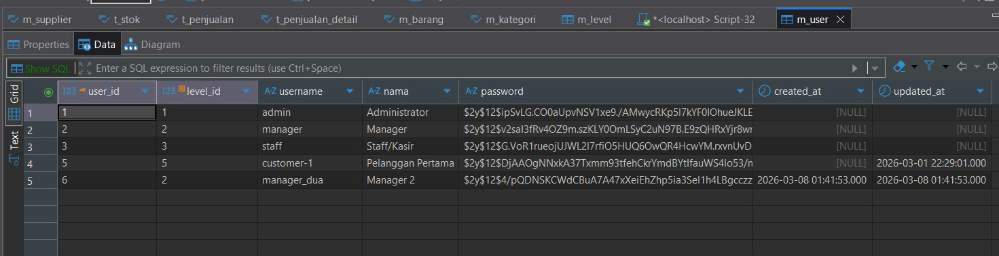

**3. Penjelasan Langkah 7 (`firstOrNew` - Data Sudah Ada):**
Mencari data 'manager'. Karena cocok, model dikembalikan untuk ditampilkan.

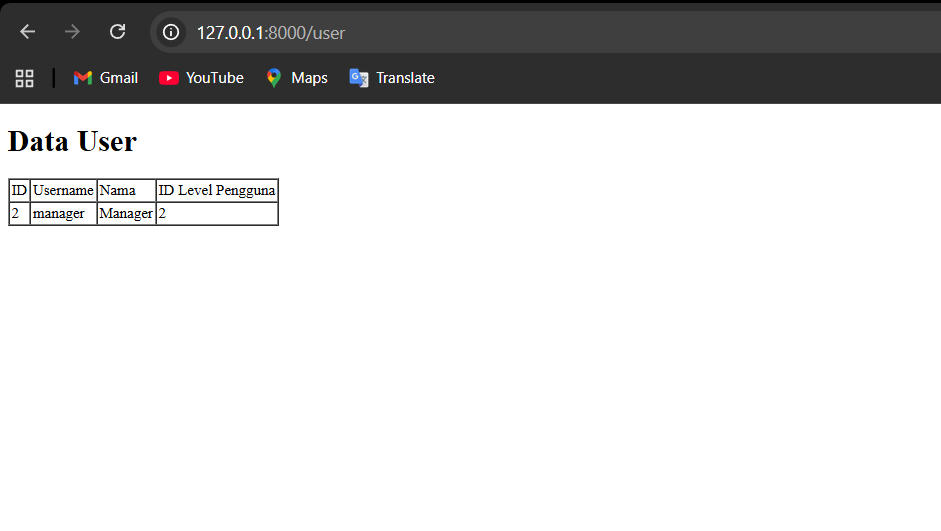

**4. Penjelasan Langkah 9 & 11 (`firstOrNew` - Data Belum Ada vs Disimpan):**
Pada Langkah 9, parameter 'manager33' tidak ditemukan. `firstOrNew` membuat *instance* baru namun **belum menyimpannya ke database**. Pada Langkah 11, pemanggilan `$user->save()` akhirnya menyimpan data tersebut ke tabel `m_user`.

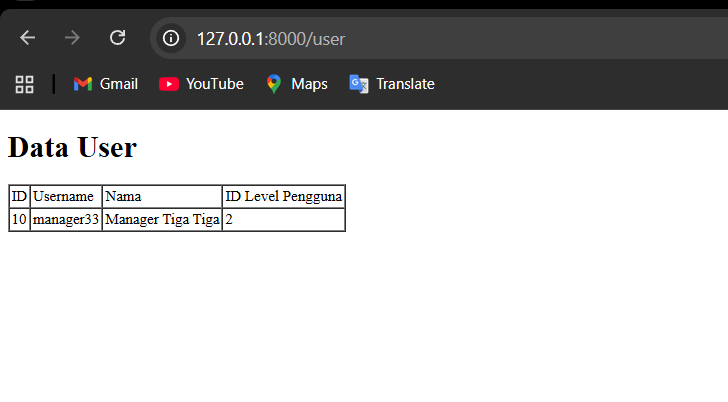
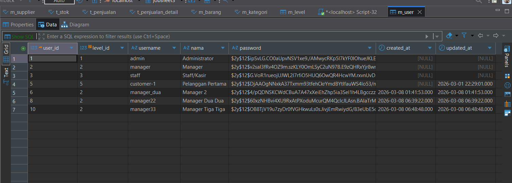

---

## Praktikum 2.5 - Attribute Changes

**1. Penjelasan Langkah 2 (`isDirty` dan `isClean`):**
Saat `$user->username` diubah, atribut tersebut dalam keadaan "kotor" (`isDirty` = true). Setelah `$user->save()` dipanggil, data tersimpan sehingga model kembali bersih (`isClean` = true).

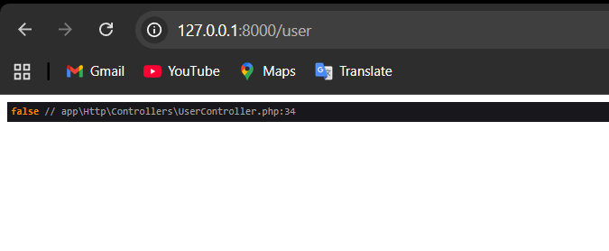

**2. Penjelasan Langkah 4 (`wasChanged`):**
Metode `wasChanged` mengecek apakah atribut diubah saat model terakhir disimpan (`save()`). Karena 'username' diubah lalu di-`save()`, pemanggilan `wasChanged()` mengembalikan nilai *true*.

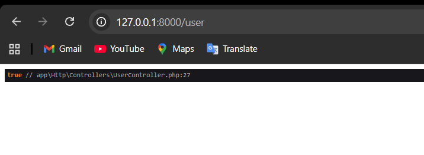

---

## Praktikum 2.6 - Create, Read, Update, Delete (CRUD)

**1. Penjelasan Langkah 3 (Read):**
Fungsi `index()` memanggil `UserModel::all()` yang membaca seluruh tabel dan meneruskannya ke *view* untuk diiterasi menjadi tabel data pengguna.

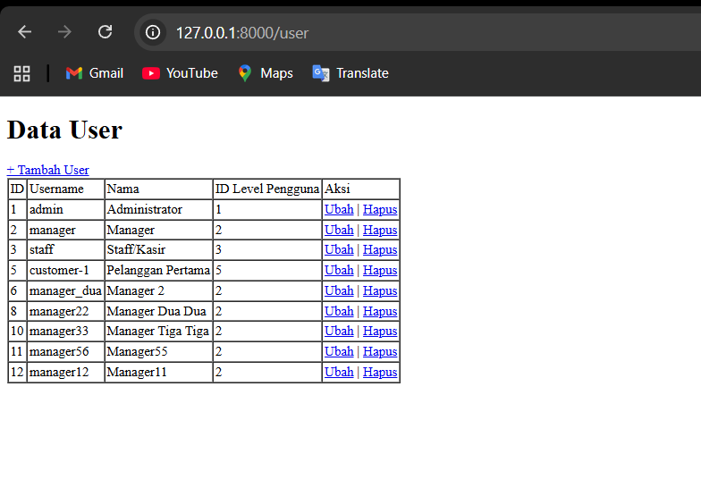

**2. Penjelasan Langkah 7 & 10 (Create):**
Pengeklikan "Tambah User" membuka *form*. Saat disubmit, metode `tambah_simpan()` mengeksekusi `UserModel::create()`, memasukkan entri baru, dan me-*redirect* kembali ke daftar.

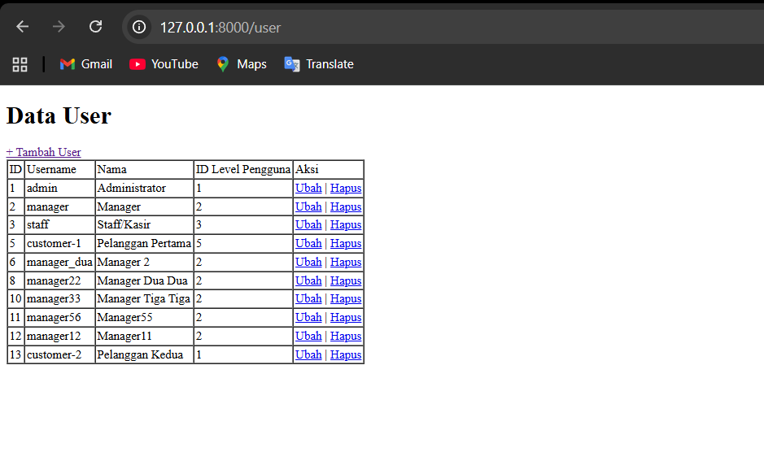

**3. Penjelasan Langkah 14 & 17 (Update):**
Tombol "Ubah" membawa ID spesifik. `find($id)` menarik data lama ke *form*. Setelah disubmit, metode pembaruan dijalankan dan diakhiri dengan `save()`.

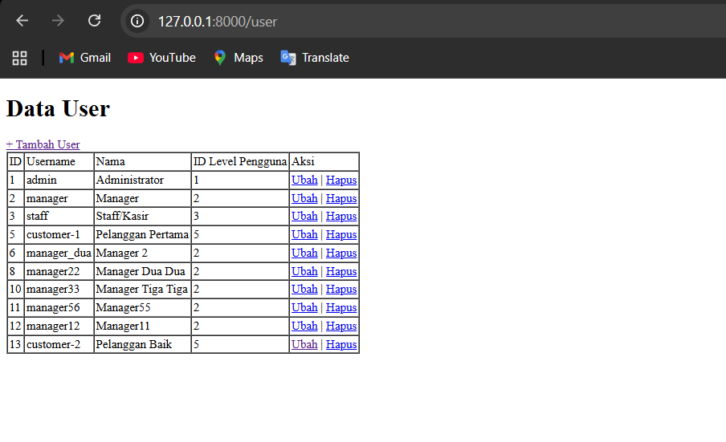

**4. Penjelasan Langkah 20 (Delete):**
Tombol hapus memanggil *route* penghapusan. Kode mengeksekusi `find($id)` dilanjutkan dengan `delete()` untuk menghapus baris dari database.

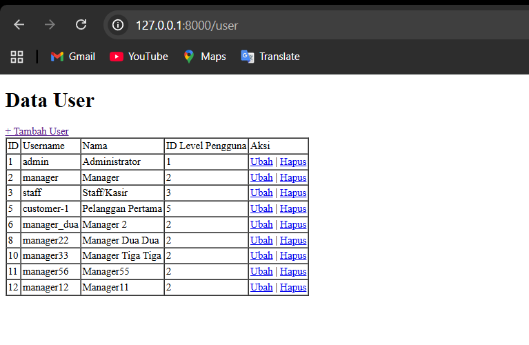

---

## Praktikum 2.7 - Relationships

**1. Penjelasan Langkah 3 (`with('level')`):**
Metode `with('level')` melakukan *eager loading* berdasarkan relasi `BelongsTo`. *Output* menampilkan objek *user* yang properti `relations`-nya berisi model dari tabel *level* terkait.

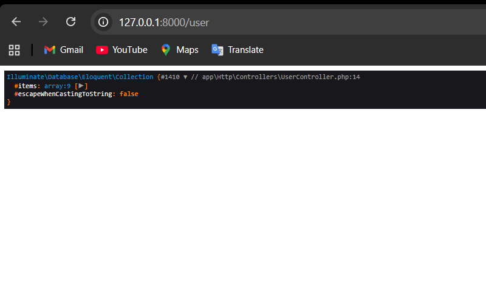

**2. Penjelasan Langkah 6 (Menampilkan Data Relasi):**
Di *view*, relasi diakses melalui `$d->level->level_kode`. Ini membuktikan ORM berhasil menghubungkan tabel `m_user` dan `m_level`.

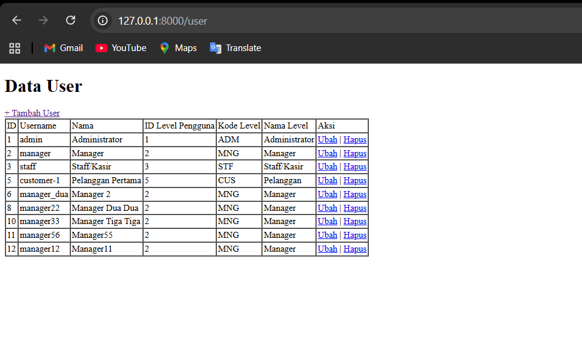