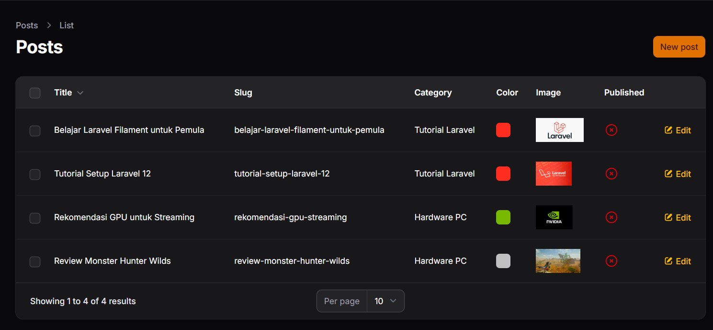
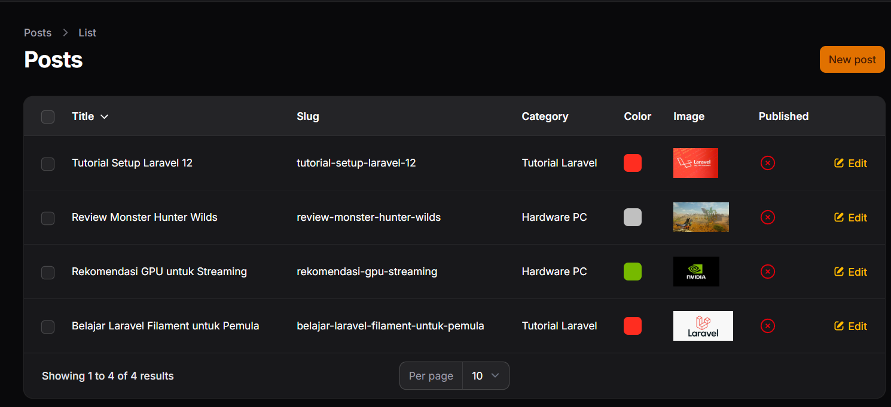
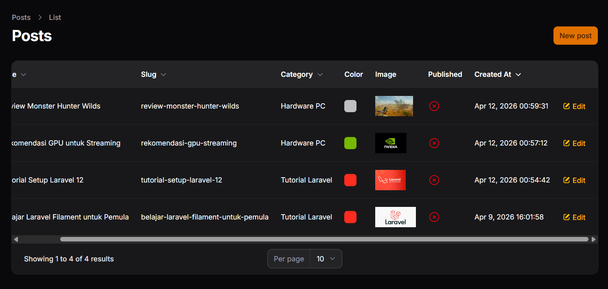

# LAPORAN PRAKTIKUM

**Nama:** Adi Luhung
**NIM:** 244107020088
**Mata Kuliah:** Pemrograman Web Lanjut
**Program Studi:** Teknik Informatika
**Institusi:** Politeknik Negeri Malang

---

## Pertemuan 10: Implementasi Sorting (Ascending & Descending) pada Table Filament

### A. Capaian Pembelajaran
Setelah menyelesaikan praktikum ini, mahasiswa mampu:
- Menambahkan fitur sorting kolom pada tabel Filament.
- Menggunakan method `sortable()`.
- Menerapkan sorting pada kolom relasi.
- Menerapkan sorting pada kolom tanggal.
- Mengatur default sorting tabel.

### B. Dasar Teori
Berbeda dengan Laravel bawaan yang membutuhkan *query* manual dan kondisi `orderBy`, Framework Filament menyediakan fitur *sorting* yang sangat sederhana. Pengurutan data pada tabel dapat dilakukan hanya dengan menambahkan method `->sortable()` pada instansiasi kolom. Selain itu, tabel dapat diatur agar memiliki urutan bawaan (otomatis) saat halaman pertama kali dimuat menggunakan method `->defaultSort()`.

### C. Langkah Kerja & Implementasi

1. **Sorting Kolom Teks (Title & Slug):** Membuka file `PostsTable.php` dan mengaktifkan fitur *sorting* pada kolom teks dengan menambahkan method `->sortable()`. Kode yang diimplementasikan adalah `TextColumn::make('title')->sortable()` dan `TextColumn::make('slug')->sortable()`. Fitur ini memungkinkan data diurutkan secara *Ascending* (A-Z) maupun *Descending* (Z-A).

2. **Sorting Relasi (Category):** Menerapkan *sorting* pada data yang bersumber dari tabel relasi dengan memanggil nama relasi dan kolomnya, yaitu `TextColumn::make('category.name')->sortable()`. Filament secara otomatis menangani operasi *join* pada relasi *database* di balik layar.

3. **Sorting Kolom Tanggal (Created At):** Menambahkan kolom baru untuk mencatat waktu pembuatan data menggunakan `TextColumn::make('created_at')->dateTime()->sortable()`. Data kini dapat diurutkan berdasarkan entri terbaru atau terlama.

4. **Pengaturan Default Sorting:** Menambahkan urutan bawaan tabel dengan menyisipkan `->defaultSort('created_at', 'asc')` pada rantai konfigurasi `$table`. Parameter `'asc'` digunakan untuk urut naik, sedangkan `'desc'` untuk urut turun (data terbaru tampil paling atas).

### D. Kendala & Troubleshooting Praktikum
Selama proses uji coba halaman Filament, terjadi kendala *Internal Server Error* dengan keterangan:

> `Illuminate\Database\QueryException: SQLSTATE[HY000] [2002] No connection could be made because the target machine actively refused it`

**Analisis Masalah:**
Error ini mengindikasikan bahwa sistem Laravel gagal melakukan koneksi ke *database* MySQL di alamat `127.0.0.1` pada port `3306`.

**Penyelesaian:**
Masalah diselesaikan dengan memastikan bahwa *service* MySQL pada *web server environment* (seperti XAMPP/Laragon) telah berstatus *Running*. Selain itu, telah dilakukan pengecekan pada file `.env` untuk memastikan *credentials* dan *port database* sudah terkonfigurasi dengan benar (tidak berbenturan dengan *port* aplikasi lain).

### E. Hasil Praktikum (Screenshot)

Berikut adalah lampiran *screenshot* hasil dari uji coba Latihan Praktikum:

**1. Sorting Title Asc**
*(Tabel diurutkan berdasarkan Title A-Z)*

**2. Sorting Title Desc**
*(Tabel diurutkan berdasarkan Title Z-A)*

**3. Sorting Date Desc**
*(Tabel diurutkan berdasarkan Created At dari yang terbaru)*

### F. Kesimpulan
Pada pertemuan ini, praktikum implementasi *sorting* tabel pada *admin panel* menggunakan Filament telah berhasil dilakukan. Fitur *sorting* berhasil diterapkan pada kolom teks standar, kolom relasi *database*, dan kolom format tanggal. Penerapan fitur fungsional seperti ini, beserta pengaturan *default sorting*, sangat krusial dan penting untuk mempermudah manajemen data berskala besar.