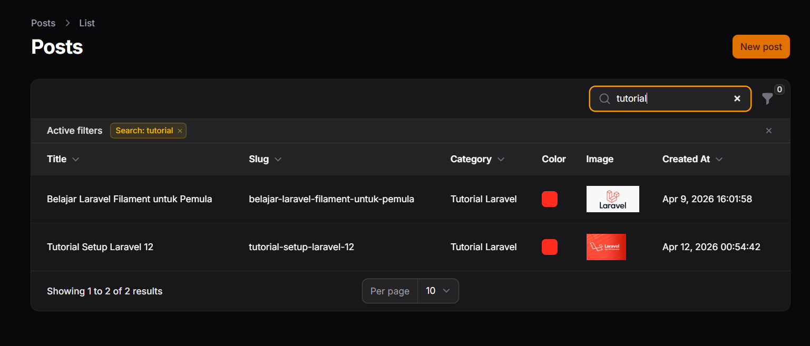
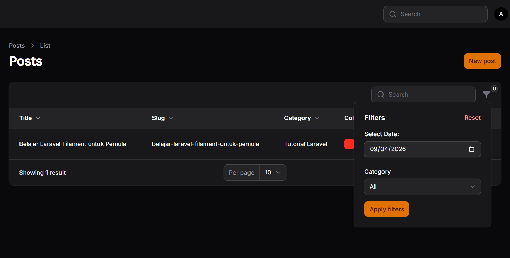
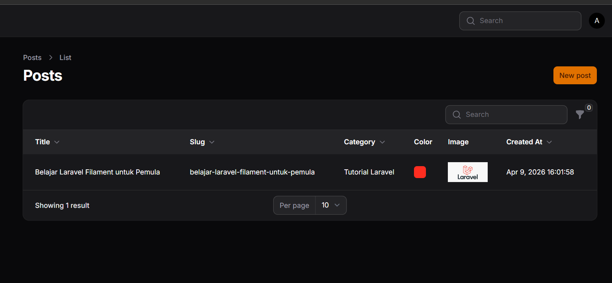
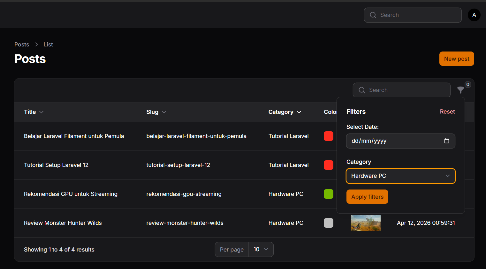
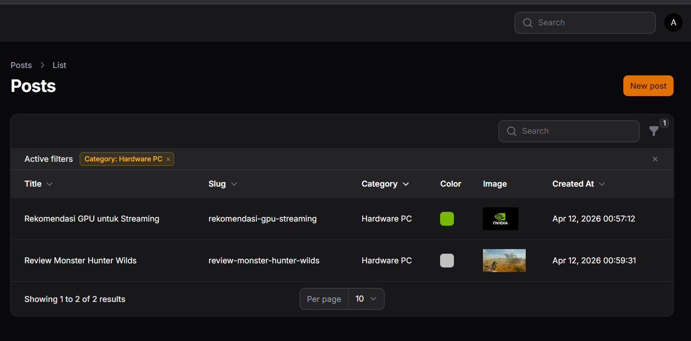
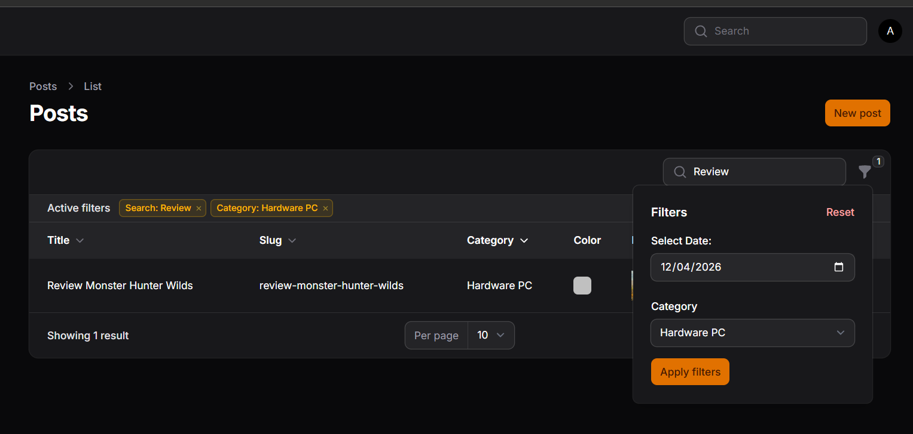
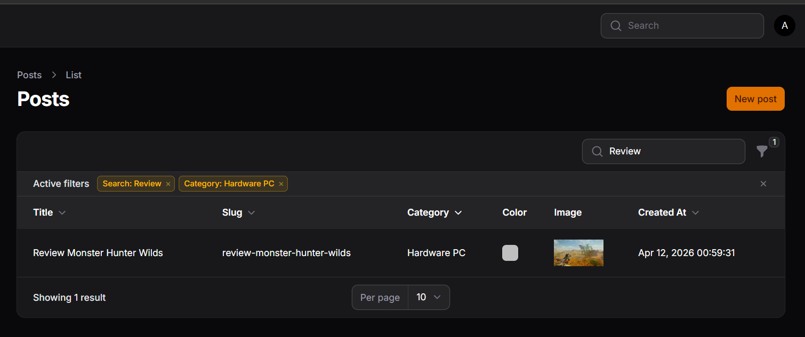

# LAPORAN PRAKTIKUM PEMROGRAMAN WEB LANJUT
## PERTEMUAN 11 - IMPLEMENTASI SEARCH & FILTER PADA TABLE FILAMENT

**Nama:** [Adi Luhung]  
**NIM:** [244107020088]  
**Kelas:** [TI 2F]  

---

## ☑️ I. Capaian Pembelajaran
Setelah mengikuti praktikum ini, mahasiswa mampu:
1. Menambahkan fitur Search (Pencarian) pada tabel.
2. Menggunakan method `searchable()`.
3. Membuat filter berdasarkan tanggal (Date Filter).
4. Membuat filter berdasarkan relasi (Select Filter).
5. Menambahkan query custom pada filter.
6. Menggabungkan fitur Search dan Filter secara bersamaan.

---

## 📖 II. Latar Belakang & Dasar Teori
Pada sistem informasi yang memiliki volume data yang besar, fitur *sorting* saja tidak cukup untuk memudahkan pengguna dalam menemukan informasi spesifik. Pengguna membutuhkan kapabilitas pencarian teks (seperti judul, *slug*, atau nama kategori) secara instan, serta kemampuan menyaring (*filtering*) data berdasarkan rentang waktu maupun kategori tertentu. 

Framework Filament menyediakan antarmuka yang sangat deklaratif dan sederhana untuk mengimplementasikan kedua fitur tersebut, baik pencarian teks bebas berbasis *real-time* maupun penyaringan data kompleks yang melibatkan kustomisasi *query* database.

---

## 💻 III. Implementasi Kode Praktikum

Berikut adalah implementasi lengkap pada file `PostsTable.php` untuk mengaktifkan pencarian pada 3 kolom (Title, Slug, Category), pembuatan filter tanggal (*Created At*), dan filter relasi (*Kategori*):

**File:** `app/Filament/Resources/Posts/Tables/PostsTable.php`

```php
namespace App\Filament\Resources\Posts\Tables;

use Filament\Tables\Table;
use Filament\Tables\Columns\TextColumn;
use Filament\Tables\Columns\ColorColumn;
use Filament\Tables\Columns\ImageColumn;
use Filament\Tables\Filters\Filter;
use Filament\Tables\Filters\SelectFilter;
use Filament\Forms\Components\DatePicker;
use Illuminate\Database\Eloquent\Builder;

class PostsTable
{
    public static function configure(Table $table): Table
    {
        return $table
            ->columns([
                // 1. Search pada Title
                TextColumn::make('title')
                    ->sortable()
                    ->searchable(),

                // 2. Search pada Slug
                TextColumn::make('slug')
                    ->sortable()
                    ->searchable(),

                // 3. Search pada Relasi Category
                TextColumn::make('category.name')
                    ->sortable()
                    ->searchable(),

                ColorColumn::make('color'),

                ImageColumn::make('image')
                    ->disk('public'),

                TextColumn::make('created_at')
                    ->label('Created At')
                    ->dateTime()
                    ->sortable(),
            ])
            ->defaultSort('created_at', 'asc')
            ->filters([
                // Filter Berdasarkan Tanggal (Custom Query Logic)
                Filter::make('created_at')
                    ->label('Creation Date')
                    ->schema([
                        DatePicker::make('created_at')
                            ->label('Select Date:'),
                    ])
                    ->query(function (Builder $query, array $data): Builder {
                        return $query->when(
                            $data['created_at'],
                            fn (Builder $query, $date): Builder => $query->whereDate('created_at', $date)
                        );
                    }),

                // Filter Berdasarkan Relasi (Kategori)
                SelectFilter::make('category_id')
                    ->label('Category')
                    ->relationship('category', 'name')
                    ->preload(),
            ]);
    }
}
```

## 📸 IV. Hasil Praktikum & Pengujian (Screenshots)

### 1. Pengujian Search (Title / Slug / Category)
Fitur pencarian diuji dengan mengetikkan kata kunci pada search bar utama. Tabel secara real-time menyaring data yang cocok.

> 

### 2. Pengujian Filter Tanggal (Created At)
Pengujian dilakukan dengan mengklik ikon corong filter, memilih tanggal spesifik melalui komponen DatePicker, lalu menekan tombol Apply filters. Data yang muncul hanya yang dibuat pada tanggal tersebut.

> 
> 

### 3. Pengujian Filter Kategori (SelectFilter)
Pengujian dilakukan dengan memilih opsi kategori (misal: Hardware PC) pada dropdown relasi. Sistem secara otomatis menampilkan data pos yang terikat dengan kategori yang dipilih.

> 
> 

### 4. Pengujian Semua Filter Secara Bersamaan (Search, Filter Tanggal, Filter Kategori)
Pengujian dilakukan dengan menggunakan semua filter yang tersedia (Search, Filter Tanggal, Filter Kategori) . Sistem secara otomatis menampilkan data pos yang terikat dengan semua filter yang dipilih.

> 
> 

---

## 📝 V. Analisis & Diskusi

**1. Mengapa search tidak cocok untuk filter tanggal?**
Fitur search dirancang untuk pencarian teks bebas berbasis pencocokan pola (*pattern matching* menggunakan operator LIKE pada SQL) secara *real-time*. Di sisi lain, data tanggal pada database disimpan dalam format spesifik (seperti timestamp `YYYY-MM-DD HH:MM:SS`). Jika pengguna mengetikkan format tanggal yang berbeda di search bar, sistem tidak dapat melakukan pencocokan tanpa konversi yang rumit. Oleh karena itu, Filter berbasis `DatePicker` jauh lebih efektif karena menjamin parameter masukan yang diterima sesuai dengan standar format tanggal yang tepat.

**2. Apa fungsi `relationship()` pada SelectFilter?**
Method `relationship('category', 'name')` berfungsi untuk memuat dan membangun daftar opsi pada menu dropdown secara otomatis berdasarkan relasi Eloquent yang telah didefinisikan di dalam Model.
*   Parameter pertama (`'category'`) menunjuk pada nama fungsi relasi (contoh: `belongsTo`) di dalam Model Post.
*   Parameter kedua (`'name'`) adalah nama kolom dari tabel relasi tersebut yang akan ditampilkan sebagai teks label kepada pengguna di antarmuka filter.

**3. Mengapa kita perlu `whereDate()` pada query filter?**
Kolom pencatatan waktu seperti `created_at` umumnya menggunakan tipe data DATETIME atau TIMESTAMP yang menyimpan informasi presisi dari tahun hingga ke detiknya (misal: `2026-02-28 14:36:12`). Jika kita menggunakan query standar `where('created_at', $date)`, database akan mencari data yang waktunya tepat pada jam `00:00:00`, sehingga data tidak akan ditemukan. Method `whereDate()` digunakan untuk mengabaikan parameter waktu (jam, menit, detik) dan secara spesifik hanya mencocokkan bagian tanggalnya saja (`YYYY-MM-DD`).

**4. Apa perbedaan `searchable()` dan `filters()`?**
*   `searchable()`: Digunakan untuk masukan teks bebas, dieksekusi secara instan (*real-time*) saat pengguna mengetik pada kolom pencarian utama, dan sangat ideal untuk kolom dengan tipe string seperti Title, Slug, atau Name.
*   `filters()`: Digunakan untuk menyaring data berdasarkan kondisi yang spesifik melalui komponen form input terpisah (seperti kalender atau dropdown), umumnya membutuhkan konfirmasi pengguna (tombol Apply), dan sangat ideal untuk tipe data terstruktur seperti tanggal dan relasi antar tabel.

---

## 🏁 VI. Kesimpulan
Melalui praktikum pertemuan ini, dapat disimpulkan bahwa:
*   Implementasi Search pada table Filament dapat dilakukan dengan sangat mudah hanya dengan menambahkan method `->searchable()` pada definisi `TextColumn`.
*   Implementasi Filter berbasis `DatePicker` memerlukan penambahan logika query custom menggunakan `->query()` dan `whereDate()` agar penyaringan data tanggal berjalan akurat.
*   Implementasi Filter berbasis Relasi sangat efisien jika menggunakan `SelectFilter` yang dikombinasikan dengan method `->relationship()` untuk memuat data dari tabel lain secara otomatis.
*   Penggabungan Search dan Filter mampu bekerja secara harmonis dan bersamaan untuk menyajikan kapabilitas pencarian dan penyaringan data yang andal bagi pengguna sistem.
