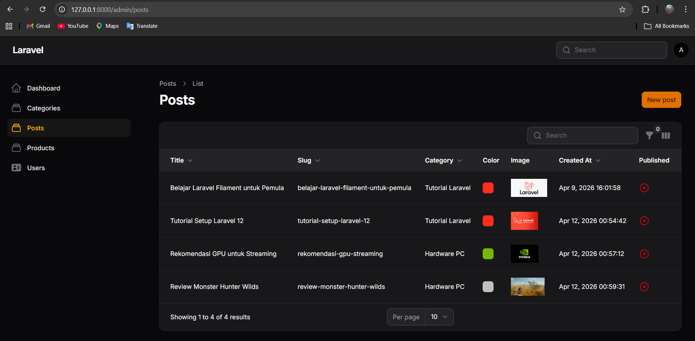
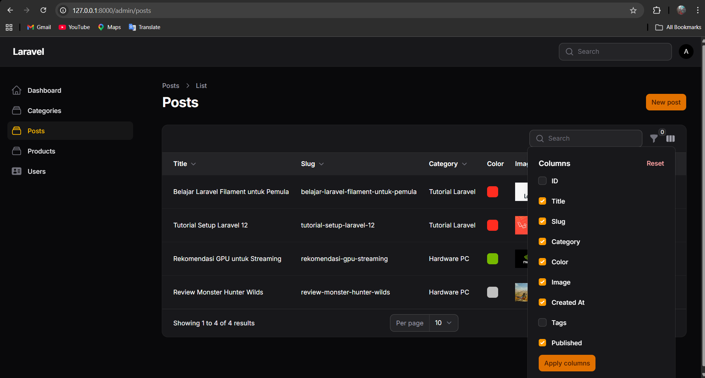
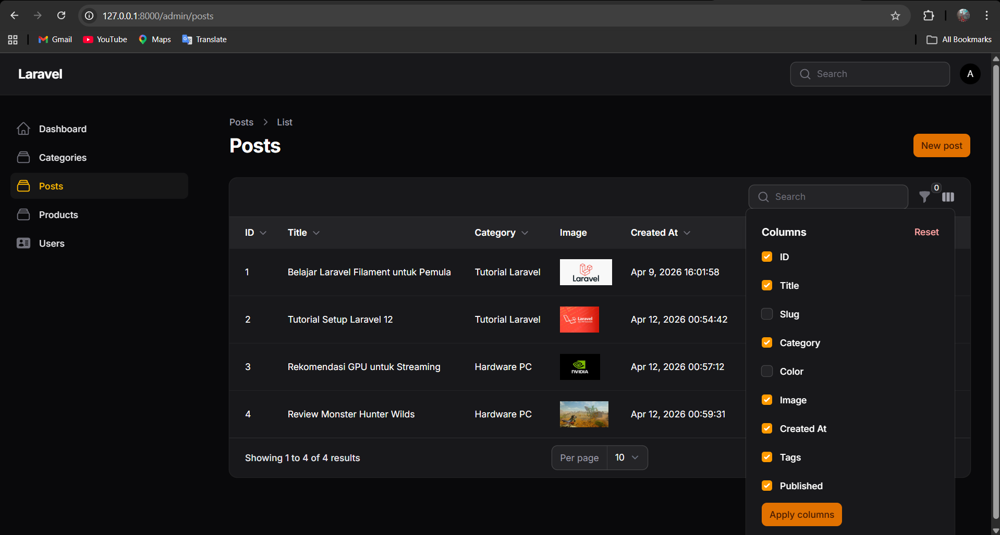
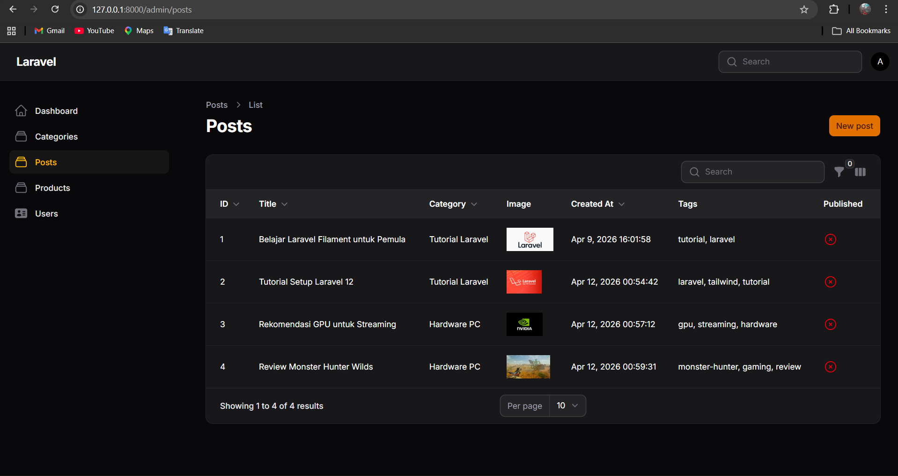

# LAPORAN PRAKTIKUM PEMROGRAMAN WEB LANJUT
## PERTEMUAN 12 - IMPLEMENTASI TOGGLE COLUMN PADA TABLE FILAMENT

**Nama:** Adi luhung

**NIM:** 244107020088

**Kelas:** TI 2F

---

## ☑️ I. Capaian Pembelajaran
Setelah mengikuti praktikum ini, mahasiswa mampu:
1. Menambahkan kolom baru pada tabel Filament.
2. Menggunakan `IconColumn` untuk tipe data *boolean*.
3. Mengaktifkan fitur `toggleable()` pada kolom.
4. Mengatur kolom agar tersembunyi secara *default*.
5. Memahami cara kerja penyimpanan preferensi kolom (berbasis *session*).

---

## 📖 II. Latar Belakang & Dasar Teori
Semakin banyak fitur dan data pada suatu entitas (misalnya `Post`), semakin banyak pula kolom yang perlu ditampilkan pada tabel utama. Jika semua kolom seperti ID, Title, Slug, Category, Tags, Image, dan rentetan waktu (Created At) ditampilkan sekaligus, antarmuka tabel akan menjadi penuh, sesak, dan sulit dibaca.

Solusi terbaik untuk menangani masalah visibilitas data ini adalah dengan menerapkan **Toggle Column**. Fitur ini memberikan fleksibilitas kepada pengguna untuk menyembunyikan atau menampilkan kolom tertentu sesuai kebutuhan mereka secara mandiri. Filament juga secara otomatis menyimpan preferensi tampilan ini ke dalam *session*, sehingga penyesuaian yang dilakukan pengguna tidak akan hilang meskipun halaman di-*refresh* atau saat berpindah menu.

---

## 💻 III. Implementasi Kode Praktikum

Pada praktikum ini, ditambahkan 3 kolom baru (`ID`, `Tags`, dan `Published`) lalu mengaktifkan method `toggleable()` pada seluruh kolom. Kolom `ID` dan `Tags` disembunyikan secara *default* memenuhi syarat Latihan Praktikum poin 1 dan 2.

**File:** `app/Filament/Resources/Posts/Tables/PostsTable.php`

```php
namespace App\Filament\Resources\Posts\Tables;

use Filament\Tables\Table;
use Filament\Tables\Columns\TextColumn;
use Filament\Tables\Columns\ColorColumn;
use Filament\Tables\Columns\ImageColumn;
use Filament\Tables\Columns\IconColumn;
use Filament\Tables\Filters\Filter;
use Filament\Tables\Filters\SelectFilter;
use Filament\Forms\Components\DatePicker;
use Illuminate\Database\Eloquent\Builder;

class PostsTable
{
    public static function configure(Table $table): Table
    {
        return $table
            ->columns([
                // 1. Kolom ID (Disembunyikan secara default)
                TextColumn::make('id')
                    ->label('ID')
                    ->sortable()
                    ->toggleable(isToggledHiddenByDefault: true),

                TextColumn::make('title')
                    ->label('Title')
                    ->sortable()
                    ->searchable()
                    ->toggleable(),

                TextColumn::make('slug')
                    ->label('Slug')
                    ->sortable()
                    ->searchable()
                    ->toggleable(),

                TextColumn::make('category.name')
                    ->label('Category')
                    ->sortable()
                    ->searchable()
                    ->toggleable(),

                ColorColumn::make('color')
                    ->toggleable(),

                ImageColumn::make('image')
                    ->disk('public')
                    ->toggleable(),

                TextColumn::make('created_at')
                    ->label('Created At')
                    ->dateTime()
                    ->sortable()
                    ->toggleable(),
                
                // 2. Kolom Tags (Disembunyikan secara default)
                TextColumn::make('tags')
                    ->label('Tags')
                    ->toggleable(isToggledHiddenByDefault: true),

                // 3. Kolom Published menggunakan IconColumn (Boolean)
                IconColumn::make('published')
                    ->label('Published')
                    ->boolean()
                    ->toggleable(),
            ])
            ->defaultSort('created_at', 'asc')
            ->filters([
                Filter::make('created_at')
                    ->label('Creation Date')
                    ->schema([
                        DatePicker::make('created_at')
                            ->label('Select Date:'),
                    ])
                    ->query(function (Builder $query, array $data): Builder {
                        return $query->when(
                            $data['created_at'],
                            fn (Builder $query, $date): Builder => $query->whereDate('created_at', $date)
                        );
                    }),

                SelectFilter::make('category_id')
                    ->label('Category')
                    ->relationship('category', 'name')
                    ->preload(),
            ]);
    }
}
```

## 📸 IV. Hasil Praktikum & Pengujian (Screenshots)

1. Tampilan Sebelum Toggle (Default View)
Pada saat halaman pertama kali dimuat, perhatikan bahwa ikon kolom di kanan atas tersedia, namun kolom ID dan Tags tidak muncul di tabel karena sudah diatur tersembunyi (hidden by default).



2. Menu Toggle Kolom (Daftar Checkbox)
Pengujian dengan menekan ikon pengaturan kolom (sebelah kanan ikon Filter). Terlihat daftar seluruh kolom beserta checkbox untuk mengatur visibilitasnya.



3. Tampilan Setelah Kolom Disesuaikan
Pengujian visibilitas dengan menyembunyikan beberapa kolom tambahan (misalnya menyembunyikan Slug dan Color) dan menampilkan kolom Tags. Pengaturan ini tetap bertahan (persisten) meskipun halaman dipindah atau di-refresh.




## 📝 V. Analisis & Diskusi
1. Mengapa toggle column penting pada admin panel?
Panel admin sering kali berhadapan dengan entitas data yang memiliki puluhan atribut. Tanpa toggle column, tabel akan memaksakan semua data tampil (menyebabkan horizontal scroll yang mengganggu) atau memaksa developer membuang data yang mungkin sewaktu-waktu dibutuhkan. Toggle column memberikan kontrol mutlak kepada pengguna untuk merapikan ruang kerjanya (workspace) dan hanya fokus pada data yang paling relevan dengan pekerjaannya saat itu, tanpa harus membuat banyak view tabel terpisah.

2. Apa perbedaan toggleable() biasa dengan isToggledHiddenByDefault?
toggleable(): Memberikan kemampuan pada kolom tersebut untuk bisa disembunyikan/ditampilkan melalui menu toggle. Namun, saat halaman pertama kali dimuat (sebelum ada pengaturan dari user), kolom tersebut akan ditampilkan di tabel.

isToggledHiddenByDefault: true: Memberikan kemampuan yang sama untuk di-toggle, namun perbedaannya ada pada status awal. Saat pertama kali dimuat, kolom ini akan langsung disembunyikan dari tabel. Pengguna harus secara manual mencentang checkbox di menu toggle jika ingin melihatnya.

3. Mengapa preferensi kolom tetap tersimpan?
Filament memiliki mekanisme internal yang secara otomatis menyimpan state atau konfigurasi antarmuka pengguna (termasuk kolom apa saja yang di-toggle) ke dalam Session pada peramban/server. Hal ini dirancang untuk menjaga User Experience (UX) agar tetap konsisten. Pengguna tidak perlu membuang waktu mengatur ulang layout tabel setiap kali mereka melakukan refresh, berpindah halaman (paginasi), atau melakukan navigasi ke menu lain dan kembali lagi.

4. Kapan sebaiknya kolom disembunyikan secara default?
Kolom sebaiknya disembunyikan secara default ketika informasi yang dimuat di dalamnya bersifat sekunder, teknis, atau jarang dibutuhkan untuk aktivitas pemindaian informasi (scanning) sehari-hari. Contohnya:

Primary Key atau UUID (seperti kolom id).

Metadata pelengkap (seperti tags, updated_at, deleted_at).

Deskripsi teks yang sangat panjang.

Data log teknis atau relasi yang hanya dibutuhkan pada kasus spesifik (seperti status audit).

## 🏁 VI. Kesimpulan
Melalui praktikum pertemuan ini, dapat disimpulkan bahwa:

Penambahan banyak kolom pada tabel bisa dikelola dengan elegan menggunakan fitur Toggle Column sehingga tidak merusak layout sistem.

Parameter isToggledHiddenByDefault: true sangat efektif untuk menjaga tabel tetap bersih (clean) sejak pertama kali dimuat dengan menyembunyikan kolom metadata.

Filament mempermudah penanganan berbagai tipe tipe data UI, seperti penggunaan IconColumn dipadukan dengan boolean() untuk mengubah data 0/1 menjadi indikator visual yang intuitif.

Fitur manajemen visibilitas ini tidak hanya kosmetik, namun fungsional berkat integrasi penyimpanan session bawaan yang meningkatkan kenyamanan operasional pada aplikasi pengelola data (admin panel).