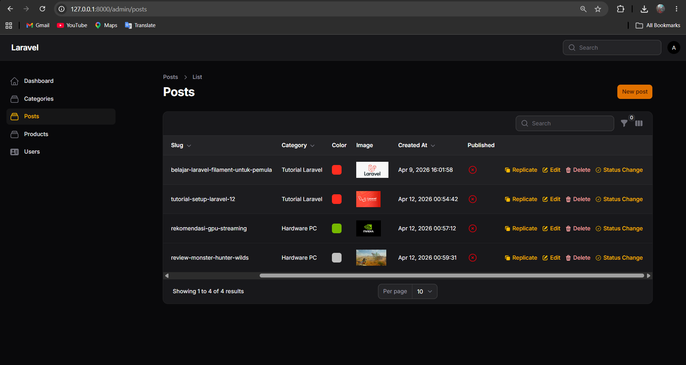
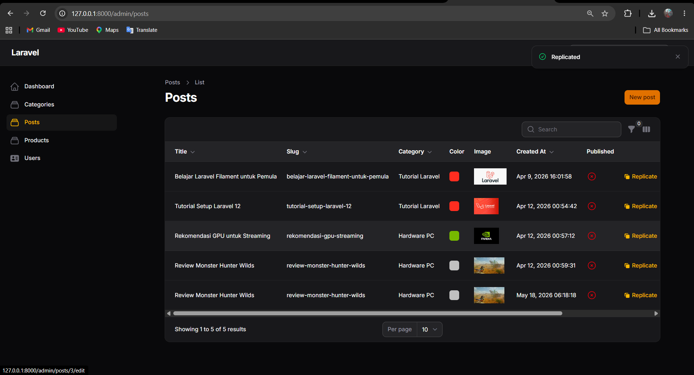
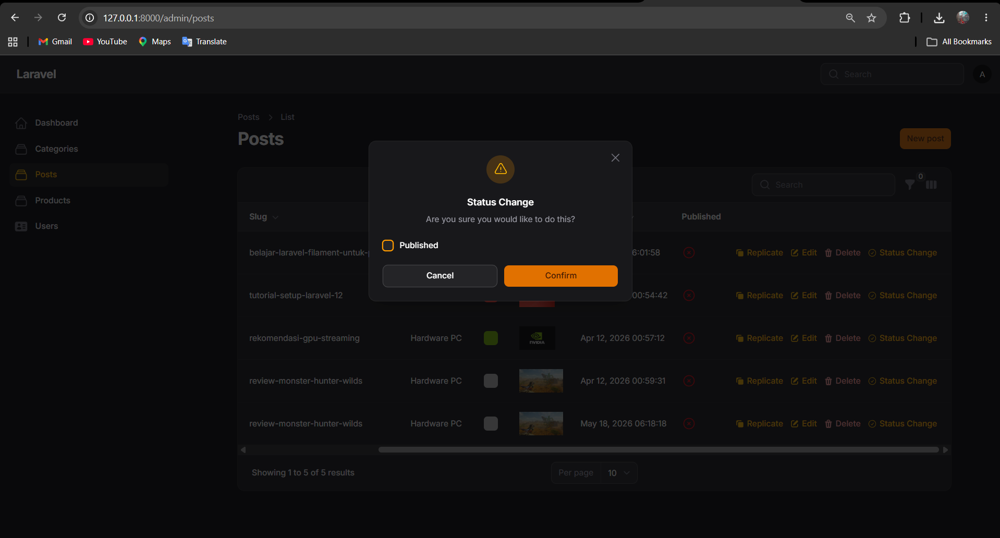
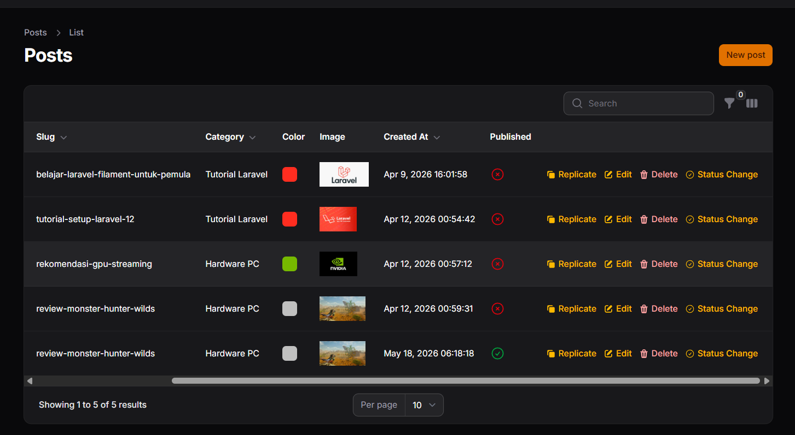

# LAPORAN PRAKTIKUM PEMROGRAMAN WEB LANJUT
## PERTEMUAN 13 - IMPLEMENTASI TABLE ACTIONS & CUSTOM ACTION

**Nama:** Adi Luhung

**NIM:** 244107020088

**Kelas:** TI 2F

---

## ☑️ I. Capaian Pembelajaran
Setelah mengikuti praktikum ini, mahasiswa mampu:
1. [cite_start]Menambahkan Record Actions pada tabel Filament[cite: 894].
2. [cite_start]Menggunakan predefined actions (Edit, Delete, Replicate)[cite: 895].
3. [cite_start]Membuat custom action pada tabel[cite: 896].
4. [cite_start]Mengupdate data langsung dari tabel tanpa masuk ke halaman edit[cite: 897].
5. [cite_start]Menambahkan label dan icon pada action[cite: 898].
6. [cite_start]Memahami konsep callback/action function pada Filament[cite: 899].

---

## 📖 II. Latar Belakang & Dasar Teori
[cite_start]Secara default, tabel Filament hanya menampilkan tombol Edit untuk setiap baris datanya [cite: 903, 904][cite_start], sedangkan tombol Delete disembunyikan di dalam halaman edit[cite: 905]. Untuk meningkatkan efisiensi dan pengalaman pengguna, Filament memungkinkan kita menambahkan berbagai *Action* langsung di baris tabel (*Record Actions*). 

[cite_start]Kita dapat menggunakan *Predefined Actions* bawaan seperti `DeleteAction` dan `ReplicateAction` (untuk menduplikasi data)[cite: 907, 908]. [cite_start]Selain itu, kita bisa membuat *Custom Action* yang dilengkapi dengan form input (seperti *Checkbox*) untuk melakukan *update* data tertentu (misalnya mengubah status publikasi) secara instan tanpa harus berpindah halaman[cite: 909, 1137, 1138].

---

## 💻 III. Implementasi Kode Praktikum

Berikut adalah implementasi lengkap pada file `PostsTable.php` yang menggabungkan fitur pencarian, filter, toggle kolom, serta penambahan **Record Actions (Delete, Replicate, dan Custom Action dengan Konfirmasi)**:

**File:** `app/Filament/Resources/Posts/Tables/PostsTable.php`

```php
namespace App\Filament\Resources\Posts\Tables;

use Filament\Tables\Table;
use Filament\Tables\Columns\TextColumn;
use Filament\Tables\Columns\ColorColumn;
use Filament\Tables\Columns\ImageColumn;
use Filament\Tables\Columns\IconColumn;
use Filament\Tables\Filters\Filter;
use Filament\Tables\Filters\SelectFilter;
use Filament\Forms\Components\DatePicker;
use Illuminate\Database\Eloquent\Builder;

// Import Actions
use Filament\Tables\Actions\EditAction;
use Filament\Tables\Actions\DeleteAction;
use Filament\Tables\Actions\ReplicateAction;
use Filament\Tables\Actions\Action;
use Filament\Forms\Components\Checkbox;

class PostsTable
{
    public static function configure(Table $table): Table
    {
        return $table
            ->columns([
                TextColumn::make('id')->label('ID')->sortable()->toggleable(isToggledHiddenByDefault: true),
                TextColumn::make('title')->label('Title')->sortable()->searchable()->toggleable(),
                TextColumn::make('slug')->label('Slug')->sortable()->searchable()->toggleable(),
                TextColumn::make('category.name')->label('Category')->sortable()->searchable()->toggleable(),
                ColorColumn::make('color')->toggleable(),
                ImageColumn::make('image')->disk('public')->toggleable(),
                TextColumn::make('created_at')->label('Created At')->dateTime()->sortable()->toggleable(),
                TextColumn::make('tags')->label('Tags')->toggleable(isToggledHiddenByDefault: true),
                IconColumn::make('published')->label('Published')->boolean()->toggleable(),
            ])
            ->defaultSort('created_at', 'asc')
            ->filters([
                Filter::make('created_at')
                    ->label('Creation Date')
                    ->schema([ DatePicker::make('created_at')->label('Select Date:'), ])
                    ->query(function (Builder $query, array $data): Builder {
                        return $query->when($data['created_at'], fn (Builder $query, $date): Builder => $query->whereDate('created_at', $date));
                    }),
                SelectFilter::make('category_id')->label('Category')->relationship('category', 'name')->preload(),
            ])
            ->recordActions([
                // 1. Replicate Action
                ReplicateAction::make(),
                
                // 2. Edit Action (Bawaan)
                EditAction::make(),
                
                // 3. Delete Action
                DeleteAction::make(),

                // 4. Custom Action (Status Change dengan Confirmation)
                Action::make('status')
                    ->label('Status Change')
                    ->icon('heroicon-o-check-circle')
                    ->requiresConfirmation() // Tambahan konfirmasi sesuai tugas praktikum
                    ->schema([
                        Checkbox::make('published')
                            ->default(fn($record): bool => (bool) $record->published),
                    ])
                    ->action(function ($record, array $data) {
                        $record->update(['published' => $data['published']]);
                    }),
            ]);
    }
}
```

## 📸 IV. Hasil Praktikum & Pengujian (Screenshots)

Catatan: Ganti teks di dalam tanda kurung siku beserta URL gambarnya dengan screenshot aslimu.

1. Tombol Delete di Tabel
Tombol Delete berwarna merah kini muncul di setiap baris tabel. Jika diklik, sistem akan langsung memunculkan pop-up konfirmasi penghapusan tanpa harus masuk ke halaman Edit.




2. Pengujian Replicate Action
Pengujian dilakukan dengan mengklik tombol "Replicate" (ikon copy/kuning) pada salah satu data. Baris data baru akan langsung tercipta dengan isi yang sama persis (duplikasi).



3. Pengujian Custom Status Action
Saat tombol "Status Change" diklik, sebuah pop-up modal (karena adanya requiresConfirmation()) muncul berisi checkbox untuk mengubah status publikasi. Saat disimpan (Submit), kolom Published langsung berubah secara real-time.  





## 📝 V. Analisis & Diskusi

1. Mengapa action di tabel lebih efisien dibanding halaman edit?
Action di tabel sangat efisien karena memangkas banyak langkah navigasi yang harus dilakukan pengguna (seperti berpindah halaman, menunggu loading form, mengklik save, dan kembali lagi ke halaman list). Dengan Table Actions, user dapat melakukan operasi CRUD dasar atau merubah status spesifik dengan satu klik langsung dari halaman indeks, yang sangat mempercepat pengelolaan data dalam jumlah besar.

2. Apa perbedaan predefined action dan custom action?
Predefined Action (seperti DeleteAction, ReplicateAction, EditAction) adalah aksi bawaan (built-in) dari Filament. Fitur ini siap pakai dan memiliki fungsi bawaan yang standar tanpa perlu mendefinisikan logika backend-nya secara manual.
Custom Action adalah aksi yang dibuat sendiri oleh developer menggunakan komponen dasar Action::make(). Pada custom action, kita bebas mendefinisikan schema (form pop-up), menetapkan ikon dan label, serta menulis blok kode ->action() sendiri untuk menentukan apa yang terjadi di database saat tombol Submit ditekan.

3. Bagaimana cara menambahkan validasi dalam custom action?
Validasi dalam custom action ditambahkan pada saat kita mendefinisikan input di dalam method ->schema([...]). Kita dapat menyambungkan (chaining) metode validasi langsung ke komponen formnya. Sebagai contoh, jika kita memiliki input teks, kita bisa menulisnya seperti: TextInput::make('catatan')->required()->maxLength(255). Saat user menekan tombol Submit di pop-up action, Filament akan secara otomatis memvalidasi input tersebut sebelum mengeksekusi blok ->action().

4. Kapan kita menggunakan Replicate?
Fitur Replicate (duplikasi data) digunakan ketika pengguna perlu membuat data baru (seperti entri tabel, postingan blog, atau produk) yang secara mayoritas informasinya sama persis dengan data yang sudah ada. Hal ini menghemat waktu pengguna karena mereka tidak perlu mengetik ulang seluruh formulir dari awal; mereka hanya perlu menduplikasi data (replicate), mengedit bagian-bagian yang berbeda, lalu menyimpannya sebagai data baru.

## 🏁 VI. Kesimpulan

Melalui praktikum pertemuan 13 ini, dapat disimpulkan bahwa:

- Penambahan Record Actions pada tabel sangat mempermudah interaksi pengguna.
- Penggunaan Predefined Actions seperti Delete dan Replicate dapat diimplementasikan dengan sangat ringkas dan cepat.
- Custom Actions memberikan fleksibilitas tanpa batas bagi developer untuk merancang fitur interaktif secara terisolasi (misalnya update parsial kolom published) langsung di dalam tampilan List tabel.
- Secara keseluruhan, pemanfaatan actions ini secara drastis meningkatkan produktivitas dan efisiensi admin panel.