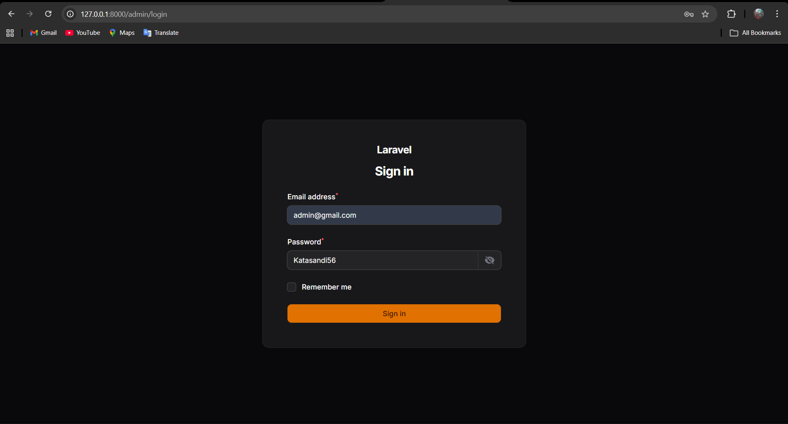
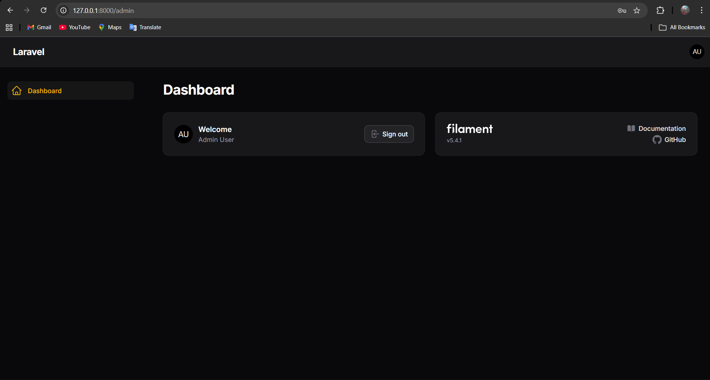
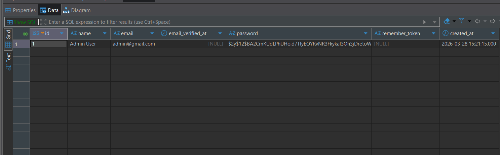

# LAPORAN PRAKTIKUM - JOBSHEET 5

**Mata Kuliah   :** Praktikum Pemrograman Web Lanjut

**Topik Utama   :** Setup & Instalasi Filament PHP v4 di Framework Laravel 11

**Data Mahasiswa**
* **Nama Lengkap  :** Adi Luhung
* **Nomor Induk   :** 244107020088
* **Program Studi :** Teknik Informatika
* **Kelas         :** 2F

---

## Garis Besar Langkah Praktikum: Setup Filament v4

Dokumen ini merupakan ringkasan panduan pelaksanaan praktikum mata kuliah Pemrograman Web Lanjut. Fokus utama pada praktikum kali ini adalah melakukan instalasi dan konfigurasi awal Filament PHP versi 4 di atas framework Laravel 11. Tujuannya agar mahasiswa mampu mengimplementasikan dan mengatur admin panel secara mandiri.

Berikut adalah urutan pengerjaannya:

**1. Inisialisasi Project Laravel Baru**
Langkah awal adalah membuat project Laravel melalui terminal. Pada tahap ini, pastikan opsi instalasi NPM dan proses *build* disetujui agar antarmuka berbasis Tailwind CSS dapat dirender dengan sempurna.

**2. Penyesuaian Konfigurasi Database**
Buka file `.env` di direktori project, kemudian atur *credentials* koneksi database agar terhubung dengan MySQL. Setelah tersambung, eksekusi perintah migrasi untuk men-generate tabel-tabel bawaan ke dalam database.

**3. Pemasangan Package Filament**
Manfaatkan Composer lewat terminal untuk mengunduh *package* Filament v4 ke dalam project. Setelah selesai, lanjutkan dengan mengeksekusi instalasi Panel Builder dan tentukan ID panelnya (contoh: "admin").

**4. Registrasi Akun User Admin**
Karena sistem *dashboard* belum memiliki pengguna yang terdaftar, jalankan *command* pembuatan user Filament. Lengkapi data yang diminta pada terminal, mulai dari nama, alamat email, hingga *password* untuk akun admin tersebut.

**5. Pengujian Akses Aplikasi**
Nyalakan server *development* Laravel. Terakhir, buka aplikasi *browser* dan kunjungi rute/URL panel admin untuk memastikan halaman *login* muncul dan kredensial yang didaftarkan berfungsi dengan baik.

---

## Kendala dan Solusi
* **Kendala :** Masalah error permission saat membuat project
* **Solusi  :** Mengganti perintha menjadi: composer require filament/filament

---

## Lampiran Screenshot Praktikum

**1. Antarmuka Halaman Login**

**2. Tampilan Dashboard Admin**

**3. Tabel User pada Database**
