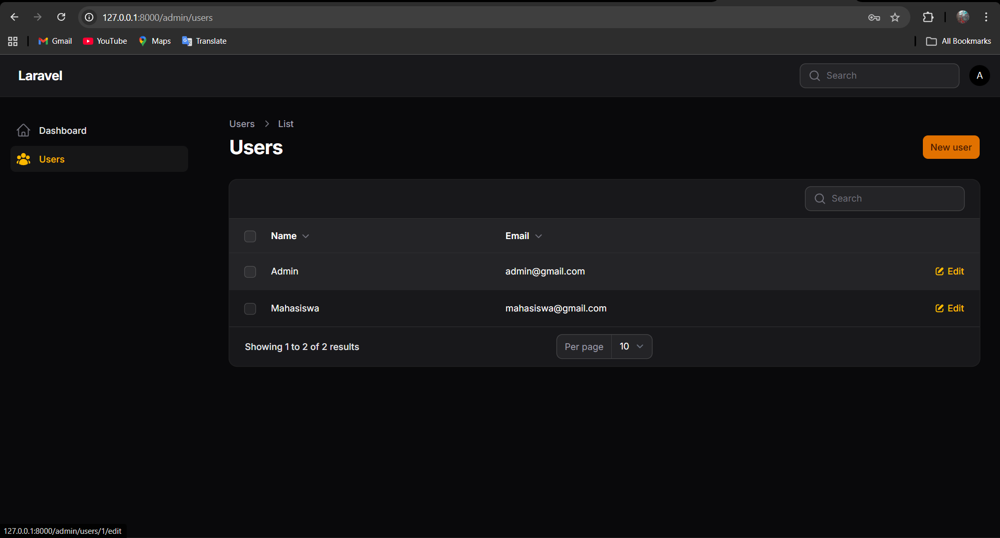
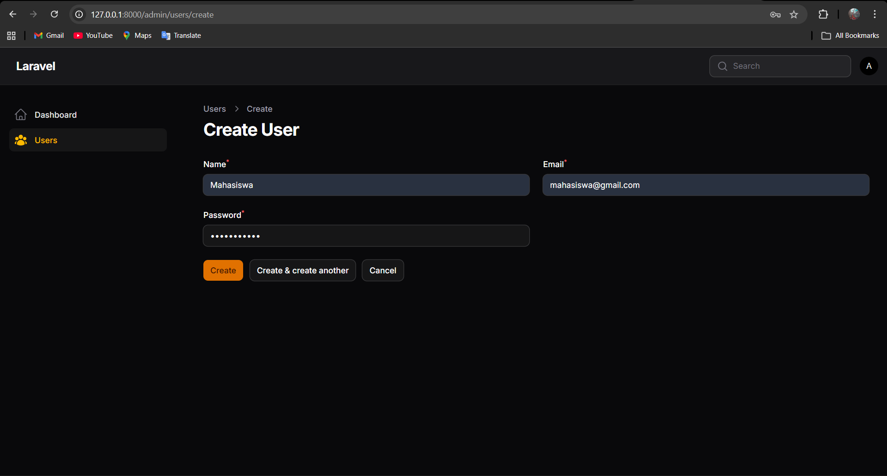
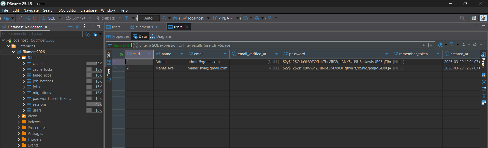

# LAPORAN PRAKTIKUM - JOBSHEET 5

**Mata Kuliah   :** Pemrograman Web Lanjut
**Topik Utama   :** Membuat CRUD Resource dengan Filament v4

**Data Mahasiswa**
* **Nama Lengkap  :** Adi Luhung
* **Nomor Induk   :** 244107020088
* **Program Studi :** Teknik Informatika
* **Kelas         :** 2F

---

## A. Garis Besar Langkah Praktikum

Dokumen ini merupakan laporan pelaksanaan praktikum untuk modul pembuatan fitur CRUD (Create, Read, Update, Delete) otomatis menggunakan Filament PHP v4. Tujuan utamanya adalah mengelola data User dari model bawaan Laravel ke dalam admin panel.

Berikut adalah urutan pengerjaan yang telah dilakukan:

**1. Pembuatan Resource User**
Membuat kerangka CRUD dasar untuk model `User` dengan menjalankan perintah artisan `php artisan make:filament-resource User` melalui terminal. Proses ini secara otomatis men-*generate* file resource utama beserta skema form dan tabel.

**2. Konfigurasi Form Input (Create & Edit)**
Melakukan modifikasi pada file `UserForm.php` di dalam direktori `Schemas`. Pada bagian ini, komponen `TextInput` ditambahkan ke dalam fungsi `configure` untuk membuat kolom isian `name`, `email`, dan `password`. 

**3. Konfigurasi Tabel Data (Read)**
Mengatur tampilan data user di halaman *dashboard* dengan memodifikasi file `UsersTable.php`. Komponen `TextColumn` digunakan untuk menampilkan kolom `name` dan `email`, lengkap dengan fitur pencarian (`searchable()`) dan pengurutan (`sortable()`).

**4. Kustomisasi Ikon Menu Resource**
Mengubah ikon *default* bawaan Filament pada menu *sidebar* menjadi ikon lain dari pustaka *Heroicons* dengan memodifikasi nilai properti `$navigationIcon` di dalam file `UserResource.php`.

**5. Pengujian Fungsionalitas CRUD**
Menjalankan *local server* dan mengakses halaman `/admin` untuk memastikan bahwa proses tambah data, edit data, hapus data, serta validasi form berjalan dengan sempurna.

---

## B. Penyelesaian Tugas Praktikum

Sesuai dengan instruksi tugas praktikum pada jobsheet, berikut adalah implementasi penambahan fitur ke dalam aplikasi:

**1. Menambahkan Validasi Form (Email Unik & Password Min. 6 Karakter)**
Validasi ditambahkan pada file `UserForm.php` dengan merangkai *method* `unique(ignoreRecord: true)` pada input email, dan `minLength(6)` pada input password.

```php
TextInput::make('email')
    ->email()
    ->required()
    ->maxLength(255)
    ->unique(ignoreRecord: true),

TextInput::make('password')
    ->password()
    ->required()
    ->minLength(6),
```

**2. Menambahkan Kolom Baru (Created at)**
Kolom waktu pendaftaran/pembuatan akun ditambahkan pada tabel daftar user di file `UsersTable.php` menggunakan komponen `TextColumn` dengan *formatter* `dateTime()`.

```php
TextColumn::make('created_at')
    ->label('Created at')
    ->dateTime()
    ->sortable(),
```

**3. Mengganti Ikon Resource dengan Heroicons Lain**
Ikon menu "Users" pada *sidebar* diubah dari defaultnya dengan mengganti nilai properti `$navigationIcon` di file `UserResource.php`.

```php
protected static ?string $navigationIcon = 'heroicon-o-identification';
```

---

## C. Analisis & Diskusi

**1. Mengapa Filament dapat membuat CRUD tanpa banyak coding?**
Filament dibangun di atas ekosistem Laravel, Livewire, dan Alpine.js yang memanfaatkan arsitektur *Resource*. Melalui satu perintah artisan, Filament langsung mampu membuat kerangka antarmuka halaman *List*, *Create*, dan *Edit* secara otomatis berdasarkan struktur Model yang sudah ada.

**2. Apa perbedaan Form Schema dan Table Schema?**
*Form Schema* digunakan untuk mengatur *layout* dan input *field* (seperti text input, file upload, dropdown) saat pengguna menambah atau mengedit data. Sedangkan *Table Schema* digunakan untuk mengatur penempatan kolom-kolom data yang ditampilkan pada halaman daftar (List), lengkap dengan kontrol aksi, fitur pencarian, dan fitur pengurutan data.

**3. Bagaimana jika kita ingin menambahkan validasi email unik?**
Kita cukup menambahkan fungsi `->unique(ignoreRecord: true)` pada komponen form email di `Form Schema`. Parameter `ignoreRecord` bertugas untuk memastikan validasi ini tidak menyebabkan *error* bentrok email saat user tersebut sedang meng-*update* data miliknya sendiri.

**4. Mengapa password tidak perlu kita hash manual?**
Karena framework Laravel secara bawaan sudah menangani proses *hashing* password menggunakan algoritma Bcrypt, baik melalui fitur *casts* pada Model `User` (`'password' => 'hashed'`) maupun *mutator* bawaan. Filament memanfaatkan mekanisme asli Laravel ini sehingga nilai *password* otomatis terenkripsi saat disimpan ke database tanpa perlu fungsi tambahan.

---

## D. Kendala dan Solusi

Selama proses praktikum, terdapat beberapa kendala teknis yang dihadapi:

1. **Kendala :** Muncul *Exception Error* berupa `Unknown database 'filament2026'` saat pertama kali mencoba mengakses panel admin.
   **Solusi  :** Menjalankan perintah `php artisan migrate` di terminal dan menekan "yes" saat sistem meminta konfirmasi untuk membuat database baru yang belum eksis tersebut, sehingga tabel-tabel bawaan Laravel berhasil di-*generate*.

2. **Kendala :** Gagal masuk (login) ke dalam halaman dashboard dengan pesan *error* "These credentials do not match our records", meskipun koneksi database sudah berhasil.
   **Solusi  :** Mengisi data awal ke dalam tabel `users` yang masih kosong dengan membuat akun administrator baru melalui perintah `php artisan make:filament-user`.

3. **Kendala :** Terjadi *Fatal Error* bertuliskan `Class "App\Filament\Resources\Users\Tables\TextColumn" not found` ketika mengedit skema tabel.
   **Solusi  :** Menambahkan baris kode *import* class (yaitu `use Filament\Tables\Columns\TextColumn;`) di bagian paling atas file `UsersTable.php` agar komponen teks kolom dapat dikenali oleh sistem.

---

## E. Lampiran Bukti Praktikum (Screenshot)

**1. Halaman List Data User**

*Keterangan: Tampilan tabel daftar pengguna yang telah dilengkapi fitur pencarian, pengurutan, dan kolom Created At.*

**2. Halaman Create / Edit User**

*Keterangan: Tampilan antarmuka form untuk menambahkan pengguna baru, lengkap dengan validasi email unik dan minimal karakter password.*

**3. Data Tersimpan di Database**

*Keterangan: Tangkapan layar database yang membuktikan bahwa operasi Create berjalan lancar dan password telah terenkripsi secara otomatis.*