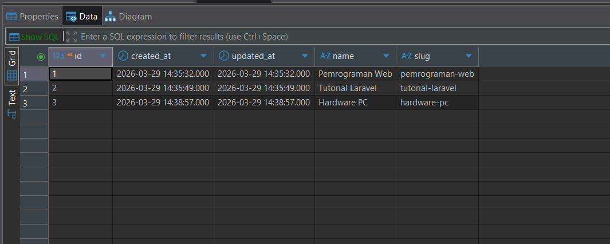
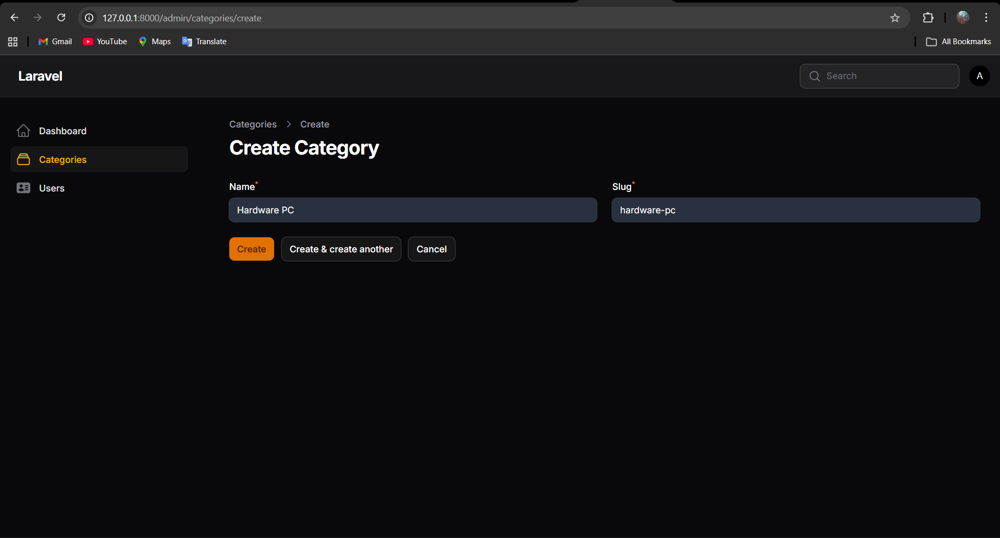
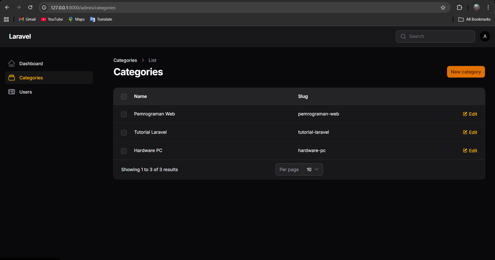

# LAPORAN PRAKTIKUM - JOBSHEET 3

**Mata Kuliah   :** Pemrograman Web Lanjut
**Topik Utama   :** Membuat Migration, Model, Relasi & Resource Category

**Data Mahasiswa**
* **Nama Lengkap  :** Adi Luhung
* **Nomor Induk   :** 244107020088
* **Program Studi :** Teknik Informatika
* **Kelas         :** 2F

---

## A. Garis Besar Langkah Praktikum

Dokumen ini merupakan laporan pelaksanaan praktikum untuk mendesain struktur database, membuat Model dan Migration, serta mengatur relasi antar tabel (One-to-Many). 

Berikut adalah urutan pengerjaan yang telah dilakukan:

**1. Pembuatan Model & Migration Category**
Membuat file Model dan Migration untuk entitas `Category` dengan perintah `php artisan make:model Category -m`. Tabel didesain dengan menambahkan kolom `name` dan `slug` bertipe *string*. Properti `$fillable` kemudian ditambahkan ke dalam Model agar data dapat disimpan menggunakan *mass assignment*.

**2. Pembuatan Model & Migration Post**
Membuat file Model dan Migration untuk entitas `Post` menggunakan perintah artisan yang sama. Struktur tabel disesuaikan dengan kebutuhan (seperti `title`, `slug`, `body`, dsb). Pada Model `Post`, ditambahkan properti `$fillable`, pengaturan `$casts` (untuk konversi otomatis tipe data seperti JSON ke array dan tipe boolean), serta pembuatan fungsi relasi `category()` menggunakan `belongsTo`.

**3. Pembuatan Resource Category di Filament**
Membuat antarmuka admin untuk Category dengan menjalankan perintah `php artisan make:filament-resource Category`. Konfigurasi diatur tanpa opsi *read-only* dan *generate from database*.

**4. Konfigurasi Form dan Table Schema**
Mengatur tampilan input form pada file `CategoryForm.php` menggunakan komponen `TextInput` untuk kolom `name` dan `slug`. Selanjutnya, mengatur tampilan data pada tabel utama melalui file `CategoriesTable.php` menggunakan komponen `TextColumn`. Proses diakhiri dengan eksekusi migrasi ke database.

---

## B. Penyelesaian Tugas Praktikum

Sesuai dengan instruksi tugas praktikum di akhir modul, berikut adalah implementasi penyelesaiannya:

**1. Validasi Slug Harus Unik**
Agar tidak ada kategori dengan URL yang sama, validasi ditambahkan langsung ke dalam `CategoryForm.php` dengan merangkai metode `unique(ignoreRecord: true)`.

```php
TextInput::make('slug')
    ->required()
    ->unique(ignoreRecord: true),
```

**2. Mengubah category_id Menjadi Foreign Key**
Pada file migrasi `_create_posts_table.php`, tipe data integer biasa untuk `category_id` diubah menjadi `foreignId` yang terikat (*constrained*) secara langsung ke tabel `categories` dengan aturan hapus berantai (*cascade*).

```php
$table->foreignId('category_id')->constrained('categories')->cascadeOnDelete();
```

**3. Menambahkan Minimal 3 Kategori Berbeda**
Melalui antarmuka Filament, saya telah menambahkan tiga data kategori baru secara manual, yaitu:
* Pemrograman Web (`pemrograman-web`)
* Tutorial Laravel (`tutorial-laravel`)
* Hardware PC (`hardware-pc`)

---

## C. Analisis & Diskusi

Berikut adalah jawaban dari pertanyaan diskusi pada jobsheet:

**1. Mengapa kita perlu `$fillable`?**
Properti `$fillable` pada Model berfungsi sebagai mekanisme keamanan *Whitelist* bawaan Laravel. Tujuannya adalah untuk mengizinkan kolom mana saja yang boleh diisi datanya secara masal (*mass assignment*), seperti saat kita menyimpan data langsung dari input form Filament.

**2. Apa fungsi `$casts` pada Laravel?**
Fungsi `$casts` digunakan untuk mengonversi (casting) tipe data atribut secara otomatis saat data tersebut dibaca atau disimpan ke database. Contohnya, mengubah data JSON di database menjadi Array saat ditarik ke aplikasi, atau mengubah kolom tanggal menjadi objek *Carbon*.

**3. Apa perbedaan integer biasa dengan foreign key?**
Kolom berjenis *integer* biasa hanya menyimpan angka bulat tanpa ada aturan keterikatan. Sedangkan *Foreign Key* adalah kolom integer yang memiliki **integritas referensial**. Artinya, database akan memastikan bahwa nilai angka yang masuk ke kolom `category_id` benar-benar eksis dan memiliki pasangan di tabel `categories`.

**4. Bagaimana jika category dihapus tetapi masih ada post?**
Tergantung pada aturan konfigurasinya. Jika kita menggunakan aturan `cascadeOnDelete()` pada *Foreign Key*, maka semua Post yang memiliki kategori tersebut akan ikut terhapus secara otomatis. Namun, jika menggunakan aturan bawaan (`restrict`), database akan memblokir proses penghapusan Category tersebut untuk mencegah adanya Post tanpa kategori (*orphan records*).

---

## D. Lampiran Bukti Praktikum (Screenshot)

**1. Struktur Tabel di Database**

*Keterangan: Struktur tabel categories di phpMyAdmin.*

**2. Form Category**

*Keterangan: Tampilan antarmuka untuk menambah data kategori baru yang telah dilengkapi validasi slug unik.*


**3. List Category**

*Keterangan: Tabel yang menampilkan data minimal 3 kategori berbeda yang telah diinputkan.*