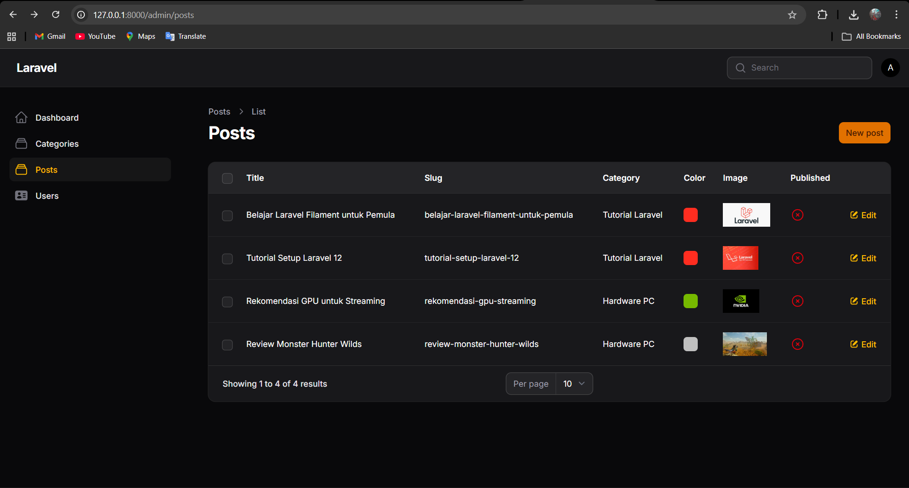
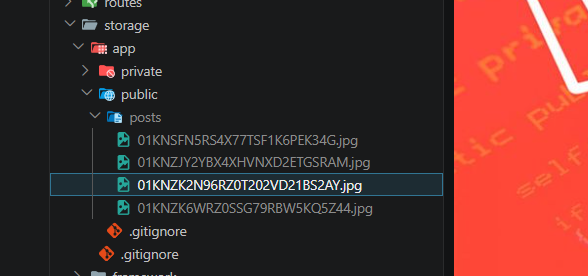

# Laporan Praktikum Pemrograman Web Lanjut

**Nama:** Adi Luhung<br>
**NIM:** 244107020088<br>
**Mata Kuliah:** Pemrograman Web Lanjut<br>
**Topik:** Implementasi Form Elements & Resource Post di Filament

---

## Tugas Praktikum

**1. Tambahkan validasi:**
* **Title minimal 5 karakter**
* **Slug unik**

Berikut adalah implementasi kodenya pada file `PostForm.php`:
```php
TextInput::make('title')
    ->required()
    ->minLength(5),

TextInput::make('slug')
    ->required()
    ->unique(ignoreRecord: true),
```

**2. Tambahkan kolom:**
* **Published (ikon boolean)**

Berikut adalah implementasi kodenya pada file `PostsTable.php`:
```php
IconColumn::make('published')
    ->boolean(),
```

**3. Buat minimal 3 Post berbeda:**
Telah diinputkan 3 data post yang berbeda ke dalam sistem, yaitu:
* Tutorial Setup Laravel 12
* Review Monster Hunter Wilds
* Rekomendasi GPU untuk Streaming

**4. Screenshot:**

* **Form Create Post**
*(screenshot form saat mengisi data)*


* **Tabel Post**
*(screenshot tabel yang menampilkan 3 post)*


* **Struktur folder storage**
*(screenshot file explorer VS Code di folder storage/app/public/posts)*


---

## Analisis dan Diskusi

**1. Mengapa kita perlu menjalankan perintah `php artisan storage:link`?**
Secara bawaan, direktori `storage/app/public` tempat Laravel menyimpan file unggahan terisolasi dan tidak dapat diakses secara langsung melalui URL browser demi keamanan. Perintah `storage:link` berfungsi membuat tautan simbolik (*symbolic link*) dari folder `public/storage` menuju folder `storage/app/public`. Tanpa link ini, gambar yang telah diunggah tidak akan bisa dimuat atau ditampilkan di antarmuka web.

**2. Apa fungsi properti `$casts` untuk field JSON?**
Field database bertipe JSON menyimpan data dalam bentuk *string*. Properti `$casts` pada model Laravel berfungsi mengubah tipe data tersebut secara otomatis. Laravel akan merakit *string* JSON dari database menjadi format *array* PHP saat data ditarik, dan sebaliknya, mengubah data *array* menjadi *string* JSON saat akan disimpan kembali ke database.

**3. Mengapa kita menggunakan `category.name` bukan `category_id` di tabel?**
Kita menggunakan `category.name` agar informasi yang tampil di layar berupa teks yang mudah dibaca (misalnya "Laravel" atau "PHP"). Jika kita menggunakan `category_id`, yang muncul di layar hanyalah angka ID dari relasi database tersebut. Penggunaan format titik (`category.name`) di Filament secara otomatis memicu pemanggilan relasi antar tabel untuk mengambil atribut nama dari tabel relasinya.

**4. Apa perbedaan RichEditor dan MarkdownEditor?**
* **RichEditor:** Menyediakan antarmuka *WYSIWYG* (What You See Is What You Get). Pengguna dapat memformat teks secara langsung layaknya di Microsoft Word, dan hasil simpanannya di dalam database berbentuk *tag* HTML murni.
* **MarkdownEditor:** Pengguna harus menggunakan sintaks pemformatan Markdown (seperti `**tebal**` atau `# heading`). Hasil yang disimpan ke dalam database adalah teks mentah (*raw*) dengan format Markdown tersebut.