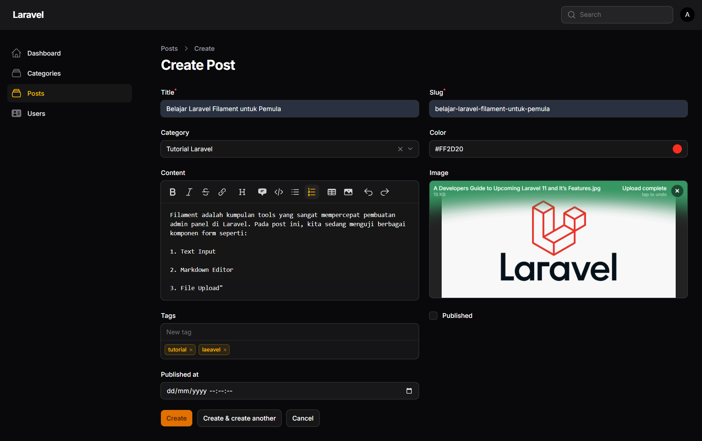
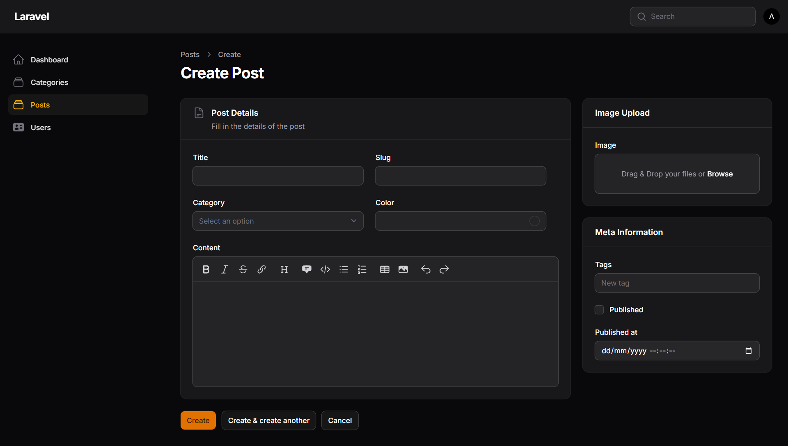

# Laporan Praktikum Pemrograman Web Lanjut

**Nama:** Adi Luhung<br>
**NIM:** 244107020088<br>
**Mata Kuliah:** Pemrograman Web Lanjut<br>
**Topik:** Custom Layout Form dengan Section & Group di Filament

---

## A. Tugas Praktikum

Berikut adalah implementasi kode pada file `PostForm.php` untuk menjawab instruksi tugas praktikum: mengatur form menjadi susunan layout 2/3 (kiri) dan 1/3 (kanan), merapikan field utama menjadi 2 kolom, dan menambahkan ikon unik pada setiap *Section*.

```php
use Filament\Forms\Components\TextInput;
use Filament\Forms\Components\Select;
use Filament\Forms\Components\ColorPicker;
use Filament\Forms\Components\MarkdownEditor;
use Filament\Forms\Components\FileUpload;
use Filament\Forms\Components\TagsInput;
use Filament\Forms\Components\Checkbox;
use Filament\Forms\Components\DateTimePicker;
use Filament\Schemas\Components\Section;
use Filament\Schemas\Components\Group;

// ...

return $schema->components([
    
    // KOLOM KIRI: Memakan porsi 2/3 layar (columnSpan 2 dari total 3 grid)
    Group::make([
        Section::make('Post Details')
            ->description('Fill in the details of the post')
            ->icon('heroicon-o-document-text') // Penambahan Icon
            ->schema([
                
                // Grouping untuk inputan utama agar menjadi 2 kolom yang rapi
                Group::make([
                    TextInput::make('title')->required(),
                    TextInput::make('slug')->required(),
                    Select::make('category_id')
                        ->relationship('category', 'name')
                        ->preload()
                        ->searchable(),
                    ColorPicker::make('color'),
                ])->columns(2),

                // Content dibiarkan memanjang memenuhi Section (full width)
                MarkdownEditor::make('content')->columnSpanFull(), 

            ]),
    ])->columnSpan(2),

    // KOLOM KANAN: Memakan porsi 1/3 layar (columnSpan 1 dari total 3 grid)
    Group::make([
        
        Section::make('Image Upload')
            ->icon('heroicon-o-photo') // Penambahan Icon berbeda
            ->schema([
                FileUpload::make('image')
                    ->disk('public')
                    ->directory('posts'),
            ]),

        Section::make('Meta Information')
            ->icon('heroicon-o-tag') // Penambahan Icon berbeda
            ->schema([
                TagsInput::make('tags'),
                Checkbox::make('published'),
                DateTimePicker::make('published_at'),
            ])

    ])->columnSpan(1)

])->columns(3); // Menetapkan total grid utama menjadi 3 kolom
```

---

## B. Hasil Pengujian Praktikum (Screenshot)

Berikut adalah dokumentasi tangkapan layar (screenshot) sebagai perbandingan sebelum dan sesudah form di-*layout*.

**1. Form Sebelum Layout**


**2. Form Sesudah Layout**


---

## C. Analisis dan Diskusi

Berikut adalah jawaban dari pertanyaan diskusi pada jobsheet terkait komponen layout di Filament:

**1. Mengapa layout form penting dalam aplikasi admin?**
Layout form sangat penting untuk meningkatkan kenyamanan dan pengalaman pengguna (*User Experience*). [cite_start]Dengan mengelompokkan form secara logis dan proporsional, form menjadi lebih mudah dibaca, mengurangi beban kognitif saat mengisi banyak data [cite: 1206][cite_start], dan membuat tampilan *interface* admin terlihat jauh lebih rapi dan profesional[cite: 1376, 1877].

**2. Apa perbedaan Section dan Group?**
* **Section:** Digunakan untuk mengelompokkan field secara visual. [cite_start]*Section* menampilkan elemen antarmuka (*UI*) yang terlihat oleh pengguna, seperti kotak pembungkus (*box*), judul, deskripsi, dan ikon[cite: 1408, 1409, 1410, 1868].
* [cite_start]**Group:** Digunakan murni untuk mengatur struktur *layout* atau grid di balik layar tanpa memunculkan tampilan kotak visual apa pun[cite: 1614, 1868]. *Group* sangat cocok untuk mengatur pembagian kolom (seperti membungkus *Section* agar berada di porsi kiri atau kanan).

**3. Kapan kita menggunakan columnSpanFull()?**
[cite_start]`columnSpanFull()` digunakan ketika kita ingin sebuah *field* atau komponen form membentang memenuhi ruang lebar secara penuh di dalam blok penampungnya (sebesar 100% lebar kolom yang tersedia)[cite: 1838, 1868]. Biasanya fungsi ini diterapkan pada input yang butuh ruang panjang dan luas seperti `MarkdownEditor` atau `RichEditor` untuk penulisan artikel.

**4. Apa keuntungan sistem grid 12 kolom?**
[cite_start]Sistem grid 12 kolom (seperti yang diadaptasi dari struktur Tailwind CSS) memberikan tingkat fleksibilitas *layouting* yang tinggi[cite: 1374]. Angka 12 memiliki banyak faktor pembagi yang bulat (1, 2, 3, 4, 6, 12). Hal ini memudahkan *developer* untuk membagi proporsi form ke dalam berbagai ukuran yang simetris, contohnya setengah layar (grid 6:6), sepertiga layar (grid 4:4:4), atau seperti praktikum ini yaitu proporsi dua pertiga dan sepertiga (grid 8:4 atau di-skala menjadi 2:1).