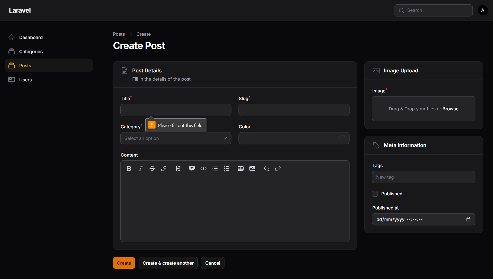
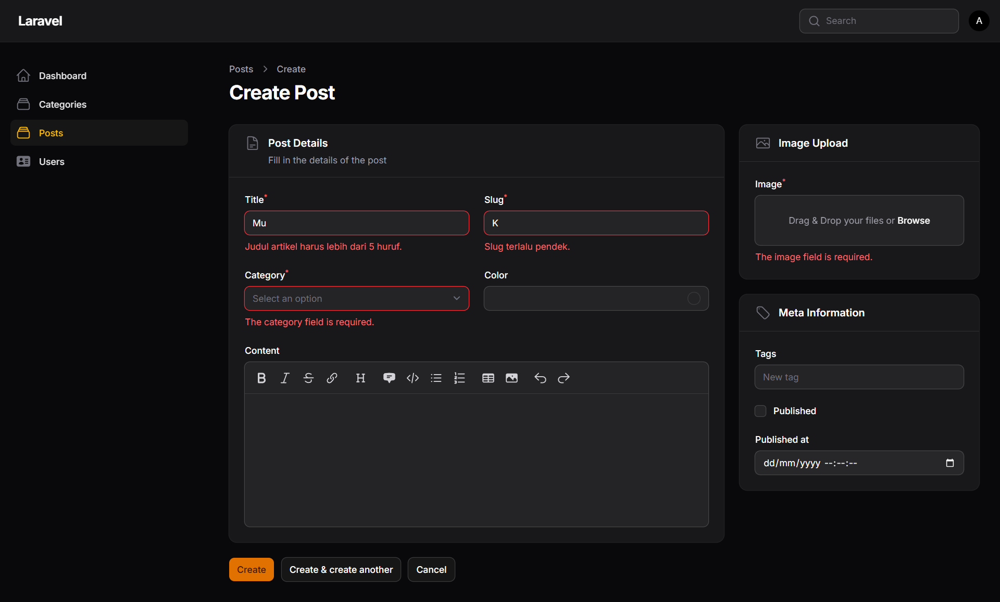
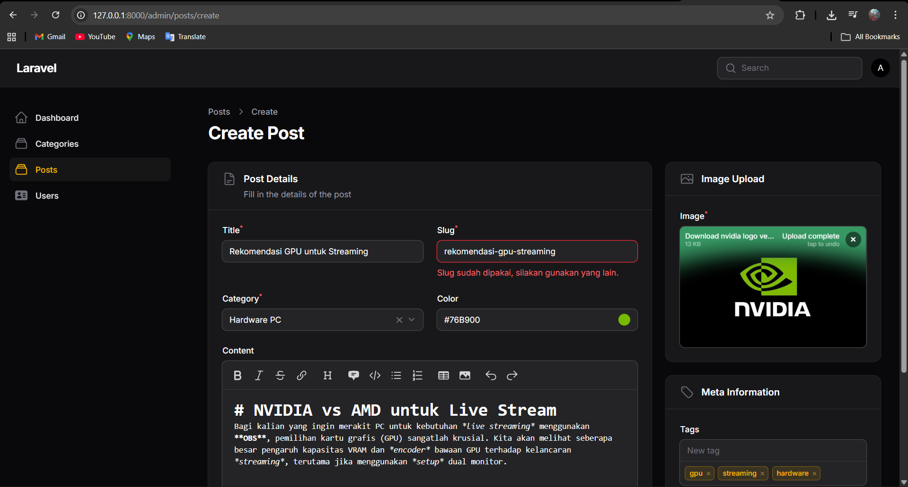

# Laporan Praktikum Pemrograman Web Lanjut

**Nama:** Adi Luhung<br>
**NIM:** 244107020088<br>
**Mata Kuliah:** Pemrograman Web Lanjut<br>
**Topik:** Implementasi Form Validation pada Filament

---

## A. Tugas Praktikum

Berikut adalah implementasi kode pada file `PostForm.php` untuk menerapkan validasi pada form pembuatan Post. Validasi yang diterapkan meliputi: *required*, *min length*, *unique*, serta penggunaan *custom validation message*.

```php
use Filament\Forms\Components\TextInput;
use Filament\Forms\Components\Select;
use Filament\Forms\Components\ColorPicker;
use Filament\Forms\Components\MarkdownEditor;
use Filament\Forms\Components\FileUpload;
use Filament\Forms\Components\TagsInput;
use Filament\Forms\Components\Checkbox;
use Filament\Forms\Components\DateTimePicker;
use Filament\Schemas\Components\Section;
use Filament\Schemas\Components\Group;

// ...

return $schema->components([
    Group::make([
        Section::make('Post Details')
            ->description('Fill in the details of the post')
            ->icon('heroicon-o-document-text')
            ->schema([
                Group::make([
                    
                    // 1. Validasi Title (Minimal 5 karakter & Custom Message)
                    TextInput::make('title')
                        ->required()
                        ->rules(['min:5'])
                        ->validationMessages([
                            'required' => 'Judul artikel tidak boleh kosong.',
                            'min' => 'Judul artikel harus lebih dari 5 karakter.'
                        ]),

                    // 2. Validasi Slug (Unik, Minimal 3 karakter & Custom Message)
                    TextInput::make('slug')
                        ->required()
                        ->unique(ignoreRecord: true)
                        ->rules(['min:3'])
                        ->validationMessages([
                            'unique' => 'Slug sudah dipakai, silakan gunakan yang lain.',
                            'min' => 'Slug terlalu pendek, minimal 3 karakter.'
                        ]),

                    // 3. Validasi Category (Wajib dipilih)
                    Select::make('category_id')
                        ->relationship('category', 'name')
                        ->preload()
                        ->searchable()
                        ->required(),

                    ColorPicker::make('color'),
                ])->columns(2),

                MarkdownEditor::make('content')->columnSpanFull(),
            ]),
    ])->columnSpan(2),

    Group::make([
        Section::make('Image Upload')
            ->icon('heroicon-o-photo')
            ->schema([
                
                // 4. Validasi Image (Wajib diupload)
                FileUpload::make('image')
                    ->disk('public')
                    ->directory('posts')
                    ->required(),

            ]),

        Section::make('Meta Information')
            ->icon('heroicon-o-tag')
            ->schema([
                TagsInput::make('tags'),
                Checkbox::make('published'),
                DateTimePicker::make('published_at'),
            ])
    ])->columnSpan(1)
])->columns(3);
```

---

## B. Hasil Pengujian Validasi (Screenshot)

Berikut adalah dokumentasi tangkapan layar (screenshot) saat form diuji dengan input yang tidak valid untuk memicu pesan *error*.

**1. Error Required (Wajib Isi)**
*(Menampilkan pesan error saat tombol Create ditekan dengan kondisi seluruh form masih kosong)*


**2. Error Min Length & Custom Message**
*(Menampilkan pesan error dengan bahasa Indonesia yang sudah di-custom karena Title diisi kurang dari 5 karakter dan Slug diisi kurang dari 3 karakter)*


**3. Error Unique**
*(Menampilkan pesan error karena Slug yang diinputkan sudah ada/kembar dengan data di dalam database)*


---

## C. Analisis dan Diskusi

Berikut adalah jawaban dari pertanyaan diskusi terkait Form Validation:

**1. Mengapa validasi penting pada admin panel?**
Validasi sangat krusial untuk menjaga integritas dan konsistensi data yang masuk ke dalam *database*. Tanpa validasi, aplikasi rentan mengalami *error* (misalnya mencoba menyimpan nilai *null* pada kolom yang tidak mengizinkan *null*), serta mencegah *user* (admin) melakukan kesalahan *human-error* saat melakukan *entry* data. Pesan validasi juga bertindak sebagai panduan bagi admin untuk memasukkan format data yang benar.

**2. Apa perbedaan validasi client-side dan server-side?**
* **Client-side:** Dilakukan di browser *user* (menggunakan HTML atau JavaScript) sesaat sebelum data dikirim. Kelebihannya adalah memberikan respon instan kepada *user*, namun kekurangannya sangat mudah diakali (di-*bypass*) oleh *user* yang mengerti teknologi.
* **Server-side:** Dilakukan di server (*backend*, dalam hal ini Laravel/Filament) setelah data dikirim. Ini adalah pertahanan utama dan paling aman karena memastikan data benar-benar divalidasi sebelum menyentuh *database*, meskipun butuh waktu sedikit lebih lama karena harus melakukan *request* ke server. Aplikasi yang baik selalu menggunakan validasi *server-side*.

**3. Mengapa unique otomatis bekerja saat edit data?**
Di dalam Filament, aturan validasi `unique()` dirancang secara cerdas untuk otomatis mengabaikan (ignore) data yang sedang diedit tersebut. Di balik layar, Filament menambahkan pengecualian ID dari record yang aktif (setara dengan perintah `Rule::unique('posts')->ignore($record->id)` pada Laravel murni). Ini memungkinkan kita melakukan penyimpanan ulang (*save changes*) pada data lama tanpa memicu *error* bahwa data tersebut duplikat dengan dirinya sendiri.

**4. Kapan kita perlu menggunakan rules array dibanding string?**
Menggunakan format *array* (contoh: `->rules(['required', 'min:5'])`) sangat disarankan dan lebih baik daripada format *string* (`->rules('required|min:5')`) ketika aturan validasinya sangat banyak atau kompleks. Selain itu, format *array* wajib digunakan jika kita memiliki aturan validasi yang mengandung karakter pembatas pipe `|` di dalam aturannya (misalnya pada aturan *Regex*), karena jika menggunakan *string*, Laravel akan salah membaca tanda pipe tersebut sebagai pemisah aturan. Format *array* juga membuat kode lebih rapi dan mudah dibaca.