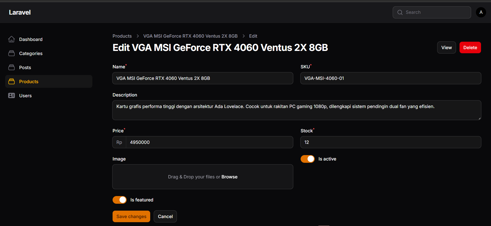
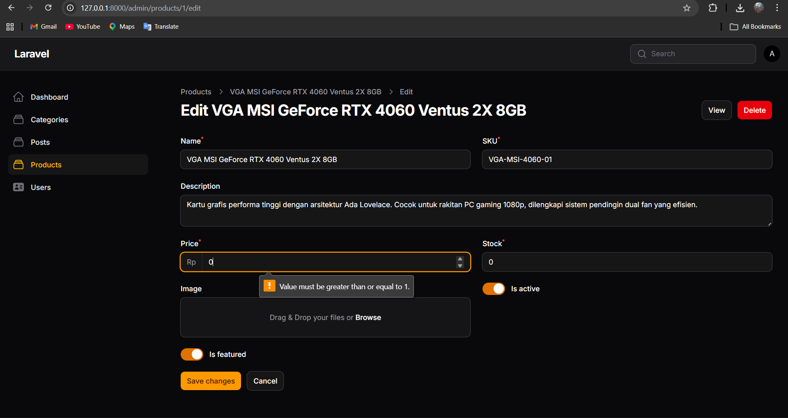
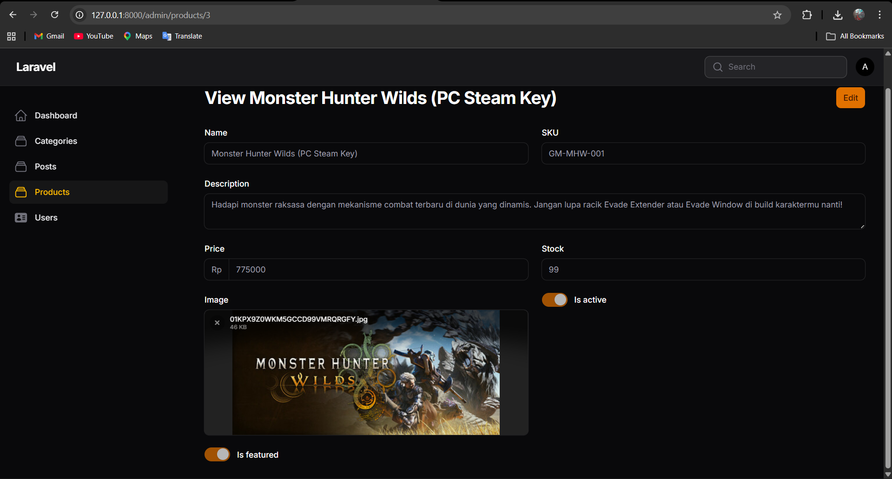
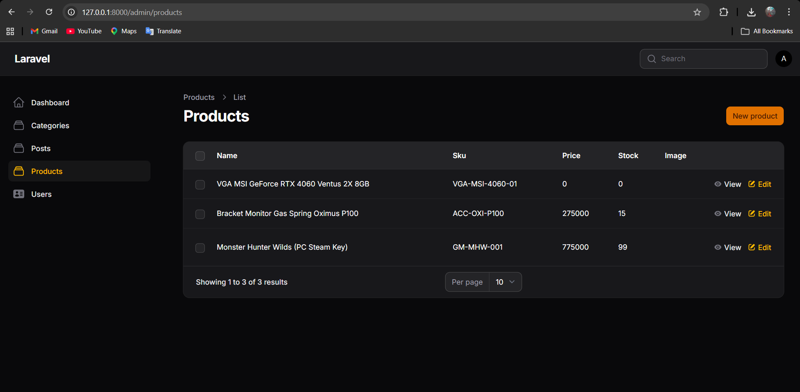

# Laporan Praktikum Pemrograman Web Lanjut
## Pertemuan 7 - Implementasi Wizard Form (Multi Step Form) di Filament

**Identitas Mahasiswa:**
* **Nama:** [Adi Luhung]
* **NIM:** [244107020088]
* **Kelas:** [2F]
* **Program Studi:** Teknik Informatika
* **Tanggal:** 23 April 2026

---

### 1. Tujuan Praktikum
Setelah mengikuti praktikum ini, mahasiswa diharapkan mampu:
1. Membuat Resource Product di Filament.
2. Menggunakan Wizard Form untuk membagi form menjadi beberapa langkah (step).
3. Menambahkan validasi pada setiap step Wizard.
4. Mengatur tombol submit khusus pada Wizard.
5. Menampilkan data hasil input pada tabel Filament.

### 2. Langkah-Langkah Praktikum

#### A. Persiapan Database (Migrasi)
Membuat tabel `products` untuk menampung data informasi produk, harga, stok, dan status.

```php
public function up(): void
{
    Schema::create('products', function (Blueprint $table) {
        $table->id();
        $table->string('name');
        $table->string('sku')->unique();
        $table->text('description')->nullable();
        $table->integer('price');
        $table->integer('stock');
        $table->string('image')->nullable();
        $table->boolean('is_active')->default(true);
        $table->boolean('is_featured')->default(false);
        $table->timestamps();
    });
}
```

#### B. Konfigurasi Model
Menyiapkan model `Product.php` dengan properti `$fillable` dan `$casts`.

```php
protected $fillable = [
    'name', 
    'sku', 
    'description', 
    'price', 
    'stock', 
    'image', 
    'is_active', 
    'is_featured'
];

protected $casts = [
    'is_active' => 'boolean',
    'is_featured' => 'boolean',
    'price' => 'integer',
    'stock' => 'integer',
];
```

#### C. Implementasi Wizard Form
Membagi form produk menjadi tiga tahap: Product Info, Pricing & Stock, serta Media & Status.

```php
// app/Filament/Resources/Products/Schemas/ProductForm.php
public static function configure(Schema $schema): Schema
{
    return $schema->components([
        Wizard::make([
            Step::make('Product Info')
                ->description('Isi Informasi Produk')
                ->schema([
                    Group::make([
                        TextInput::make('name')->required(),
                        TextInput::make('sku')->required(),
                    ])->columns(2),
                    MarkdownEditor::make('description')
                        ->columnSpanFull(),
                ]),
                
            Step::make('Product Price and Stock')
                ->description('Isi Harga Produk')
                ->schema([
                    Group::make([
                        TextInput::make('price')
                            ->numeric()
                            ->required()
                            ->minValue(1),
                        TextInput::make('stock')
                            ->numeric()
                            ->required(),
                    ])->columns(2),
                ]),
                
            Step::make('Media and status')
                ->description('Isi Gambar Produk')
                ->schema([
                    FileUpload::make('image')
                        ->disk('public')
                        ->directory('products'),
                    Checkbox::make('is_active'),
                    Checkbox::make('is_featured'),
                ])->columnSpanFull(),
        ])->submitAction(
            Action::make('save')
                ->label('Save Product')
                ->button()
                ->color('primary')
                ->submit('save')
        )
    ]);
}
```

#### D. Menghilangkan Tombol Bawaan
Melakukan override pada file Page `CreateProduct.php` agar tidak terjadi duplikasi tombol submit.

```php
// app/Filament/Resources/Products/Pages/CreateProduct.php
protected function getFormActions(): array
{
    return [];
}
```

#### E. Konfigurasi Tabel Produk
Menampilkan data yang telah diinput ke dalam tabel di halaman list.

```php
// app/Filament/Resources/Products/Tables/ProductsTable.php
public static function configure(Table $table): Table
{
    return $table->columns([
        TextColumn::make('name'),
        TextColumn::make('sku'),
        TextColumn::make('price'),
        TextColumn::make('stock'),
        ImageColumn::make('image')
            ->disk('public'),
    ]);
}
```

### 3. Hasil dan Pembahasan
Berdasarkan praktikum yang dilakukan, Wizard Form mempermudah pengguna dalam mengisi data yang kompleks dengan membaginya menjadi bagian-bagian kecil yang terfokus. Penambahan validasi pada setiap tahap memastikan data yang masuk akurat sebelum berpindah ke tahap berikutnya.

### 4. Tugas Praktikum (Dokumentasi Screenshot)
Silakan lampirkan screenshot hasil pengerjaan Anda pada bagian di bawah ini:

#### 4.1 Wizard Step 1: Product Info
**Deskripsi:** Menampilkan input Name, SKU, dan Description.



#### 4.2 Wizard Step 2: Pricing & Stock
**Deskripsi:** Menampilkan input Harga (dengan validasi > 0) dan Stok.



#### 4.3 Wizard Step 3: Media & Status
**Deskripsi:** Menampilkan upload gambar dan status aktif/featured.



#### 4.4 Halaman List Product (Tabel)
**Deskripsi:** Menampilkan 3 data produk yang berhasil diinput.



### 5. Kesimpulan
Implementasi Wizard Form di Filament memberikan pengalaman pengguna yang lebih baik untuk form yang panjang. Penggunaan file skema terpisah (`ProductForm` dan `ProductsTable`) juga membuat kode lebih rapi dan mudah dikelola (maintainable).