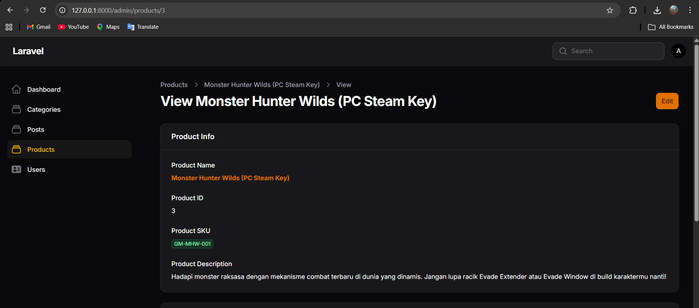
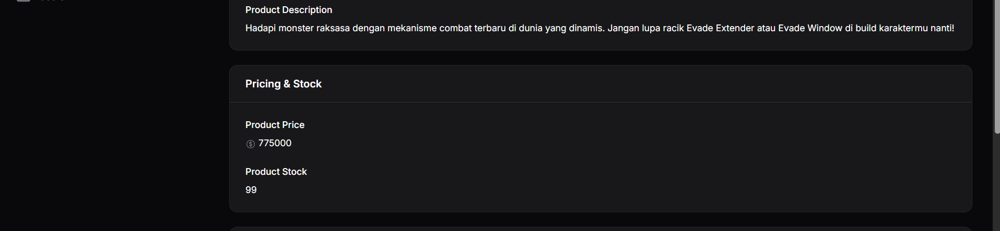
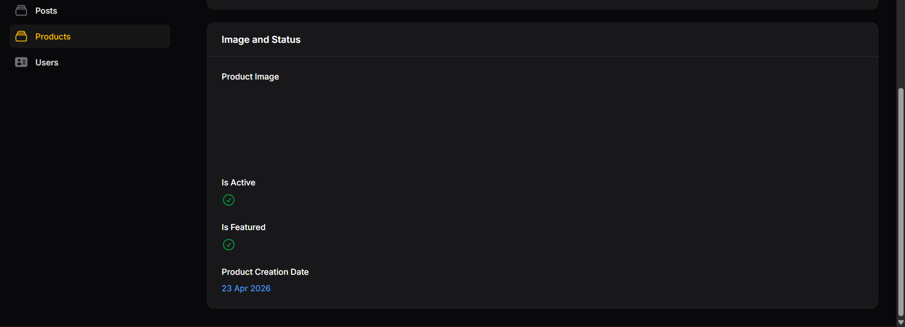

# Laporan Praktikum Pemrograman Web Lanjut
## Pertemuan 8 - Implementasi Info List (View Page) di Filament

**Identitas Mahasiswa:**
* **Nama:** Adi Luhung
* **NIM:** 244107020088
* **Kelas:** 2F
* **Program Studi:** Teknik Informatika
* **Tanggal:** 23 April 2026

---

### 1. Tujuan Praktikum
Setelah mengikuti praktikum ini, mahasiswa diharapkan mampu:
1. Memahami konsep Info List pada Filament.
2. Mengubah tampilan View Page dari form menjadi display informasi.
3. Menggunakan komponen `TextEntry`, `ImageEntry`, dan `IconEntry`.
4. Menggunakan `Badge`, `Color`, `Icon`, dan `Format Date`.
5. Mendesain halaman detail (show page) yang lebih profesional.

### 2. Konsep Dasar Info List
Info List digunakan untuk mengganti tampilan *form input* pada halaman detail menjadi tampilan informasi statis (*read-only*) agar lebih profesional dan terstruktur. Perbandingan komponen utamanya adalah:
* **TextInput** menjadi **TextEntry**.
* **FileUpload** menjadi **ImageEntry**.
* **Checkbox** menjadi **IconEntry**.

### 3. Langkah-Langkah Praktikum

#### A. Persiapan Skema Info List
Mengedit file skema detail pada direktori berikut:
`app/Filament/Resources/Products/Schemas/ProductInfolist.php`

#### B. Implementasi Section - Product Info
Membuat bagian informasi dasar produk yang mencakup Nama, ID, SKU (dengan badge), Deskripsi, dan Tanggal Pembuatan.

```php
Section::make('Product Info')
    ->schema([
        TextEntry::make('name')
            ->label('Product Name')
            ->weight('bold')
            ->color('primary'),
        TextEntry::make('id')
            ->label('Product ID'),
        TextEntry::make('sku')
            ->label('Product SKU')
            ->badge()
            ->color('success'),
        TextEntry::make('description')
            ->label('Product Description'),
        TextEntry::make('created_at')
            ->label('Product Creation Date')
            ->date('d M Y')
            ->color('info'),
    ])
    ->columnSpanFull(),
```

#### C. Implementasi Section - Pricing & Stock
Menampilkan data harga dengan ikon mata uang dan jumlah stok produk.

```php
Section::make('Pricing & Stock')
    ->schema([
        TextEntry::make('price')
            ->label('Product Price')
            ->icon('heroicon-o-currency-dollar'),
        TextEntry::make('stock')
            ->label('Product Stock'),
    ])
    ->columnSpanFull(),
```

#### D. Implementasi Section - Media & Status
Menampilkan gambar produk serta status aktif dan unggulan menggunakan ikon boolean.

```php
Section::make('Image and Status')
    ->schema([
        ImageEntry::make('image')
            ->label('Product Image')
            ->disk('public'),
        IconEntry::make('is_active')
            ->label('Is Active')
            ->boolean(),
        IconEntry::make('is_featured')
            ->label('Is Featured')
            ->boolean(),
    ])
    ->columnSpanFull(),
```

### 4. Hasil dan Pembahasan
Hasil praktikum menunjukkan perubahan signifikan pada halaman detail produk. Data yang sebelumnya ditampilkan dalam field yang bisa diedit (editable) kini ditampilkan dalam format yang rapi dan bersifat baca-saja (read-only). Penggunaan `IconEntry` memudahkan identifikasi status boolean dengan ikon ceklis hijau atau silang merah secara otomatis.

### 5. Tugas Praktikum (Dokumentasi Screenshot)

#### 5.1 Section Product Info
**Deskripsi:** Menampilkan detail nama, SKU badge, dan format tanggal pembuatan.



#### 5.2 Section Pricing & Stock
**Deskripsi:** Menampilkan harga dengan simbol Rp (hasil latihan) dan ikon stok.



#### 5.3 Section Media & Status
**Deskripsi:** Menampilkan pratinjau gambar dan ikon boolean untuk status.



### 6. Kesimpulan
Melalui praktikum ini, mahasiswa telah berhasil mengimplementasikan konsep Info List untuk membuat halaman detail data yang profesional. Penggunaan berbagai komponen seperti `TextEntry`, `ImageEntry`, dan `IconEntry` memungkinkan penyajian data yang lebih informatif dan estetik di dalam panel admin Filament.
