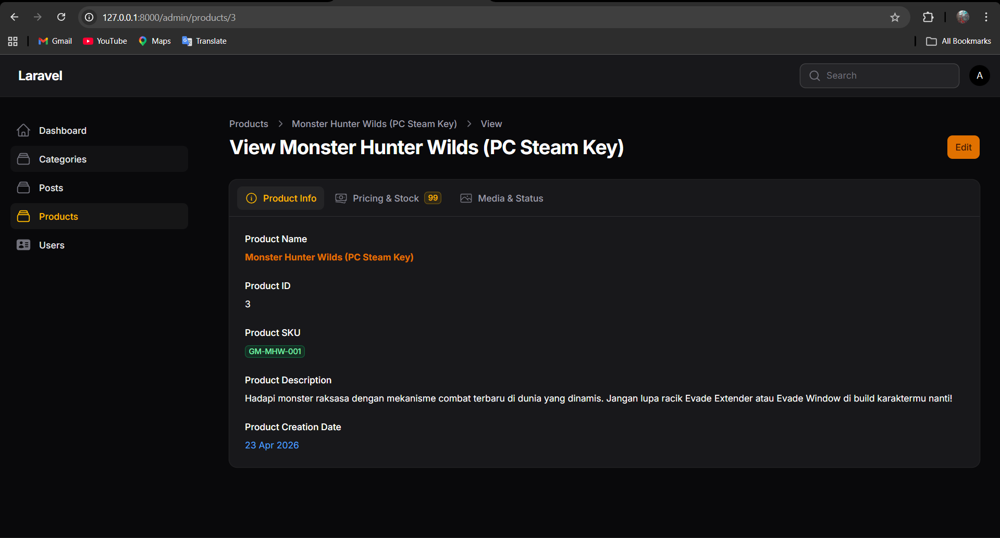
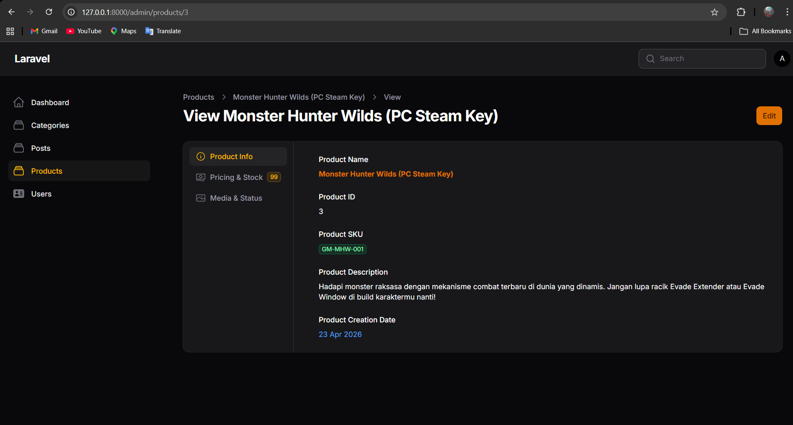
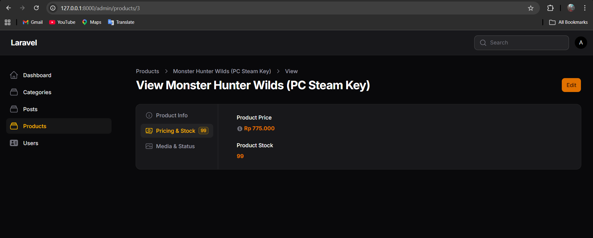

# Laporan Praktikum Pemrograman Web Lanjut
## Pertemuan 9 - Implementasi Tabs pada Info List di Filament

**Identitas Mahasiswa:**
* **Nama:** Adi Luhung
* **NIM:** 244107020088
* **Kelas:** 2F
* **Program Studi:** Teknik Informatika
* **Tanggal:** 23 April 2026

---

### 1. Tujuan Praktikum
Setelah mengikuti praktikum ini, mahasiswa diharapkan mampu:
1. Menggunakan komponen Tabs pada Info List.
2. Mengelompokkan informasi detail ke dalam beberapa tab.
3. Menambahkan icon dan badge pada tab.
4. Mengubah orientasi tab menjadi horizontal maupun vertical.
5. Mendesain halaman View agar lebih ringkas dan user-friendly.

### 2. Konsep Dasar Tabs
Komponen Tabs digunakan untuk membagi informasi detail yang panjang menjadi beberapa kategori yang dapat diakses melalui navigasi klik. Hal ini bertujuan untuk mengurangi scrolling panjang dan meningkatkan pengalaman pengguna (user experience).

### 3. Langkah-Langkah Praktikum

#### A. Persiapan dan Import Komponen
Mengedit file `ProductInfolist.php` dan menambahkan komponen `Tabs` serta `Tab` pada bagian import.

#### B. Implementasi Struktur Tabs
Mengganti penggunaan `Section` menjadi `Tabs::make` sebagai pembungkus utama komponen Info List.

```php
public static function configure(Schema $schema): Schema
{
    return $schema->components([
        Tabs::make('Product Tabs')
            ->tabs([
            ])
            ->vertical() 
            ->columnSpanFull(),
    ]);
}
```

#### C. Konfigurasi Tab 1: Product Info
Menampilkan informasi dasar produk dengan penambahan icon pada tab.

```php
Tab::make('Product Info')
    ->icon('heroicon-o-information-circle')
    ->schema([
        TextEntry::make('name')
            ->label('Product Name')
            ->weight('bold')
            ->color('primary'),
        TextEntry::make('sku')
            ->label('SKU')
            ->badge()
            ->color('success'),
        TextEntry::make('description')
            ->label('Description'),
    ]),
```

#### D. Konfigurasi Tab 2: Pricing & Stock (Dengan Badge Dinamis)
Menampilkan harga dan stok dengan penambahan badge dinamis yang mengambil data dari jumlah stok (Tugas Praktikum).

```php
Tab::make('Pricing & Stock')
    ->icon('heroicon-o-currency-dollar')
    ->badge(fn ($record) => $record ? $record->stock : '0')
    ->badgeColor('warning')
    ->schema([
        TextEntry::make('price')
            ->label('Price')
            ->icon('heroicon-s-currency-dollar')
            ->formatStateUsing(fn ($state) => 'Rp ' . number_format($state, 0, ',', '.')),
        TextEntry::make('stock')
            ->label('Stock'),
    ]),
```

#### E. Konfigurasi Tab 3: Media & Status
Menampilkan gambar produk dan status boolean.

```php
Tab::make('Media & Status')
    ->icon('heroicon-o-photo')
    ->schema([
        ImageEntry::make('image')
            ->label('Product Image')
            ->disk('public'),
        IconEntry::make('is_active')
            ->label('Active')
            ->boolean(),
        IconEntry::make('is_featured')
            ->label('Featured')
            ->boolean(),
    ]),
```

### 4. Hasil dan Pembahasan
Penggunaan komponen Tabs terbukti membuat halaman detail produk menjadi lebih ringkas. Dengan metode `->vertical()`, navigasi tab berpindah ke sisi samping, memberikan tampilan dashboard yang lebih modern. Penambahan `badge()` dinamis pada tab mempermudah admin untuk melihat ringkasan data (seperti stok) tanpa harus membuka isi tab tersebut terlebih dahulu.

### 5. Tugas Praktikum (Dokumentasi Screenshot)
Silakan lampirkan screenshot hasil pengerjaan Anda:

#### 5.1 Tampilan Tabs Horizontal
**Deskripsi:** Menampilkan navigasi tab di bagian atas.



#### 5.2 Tampilan Tabs Vertical
**Deskripsi:** Menampilkan navigasi tab di bagian samping sesuai instruksi tugas.



#### 5.3 Tab dengan Badge Dinamis
**Deskripsi:** Menampilkan badge angka stok pada tab Pricing & Stock dengan warna khusus.



### 6. Kesimpulan
Implementasi Tabs pada Filament Info List sangat efektif untuk mengelola tampilan data yang kompleks. Fitur pendukung seperti icon, badge, dan orientasi vertical memberikan fleksibilitas tinggi bagi pengembang untuk menciptakan antarmuka yang interaktif dan user-friendly.
